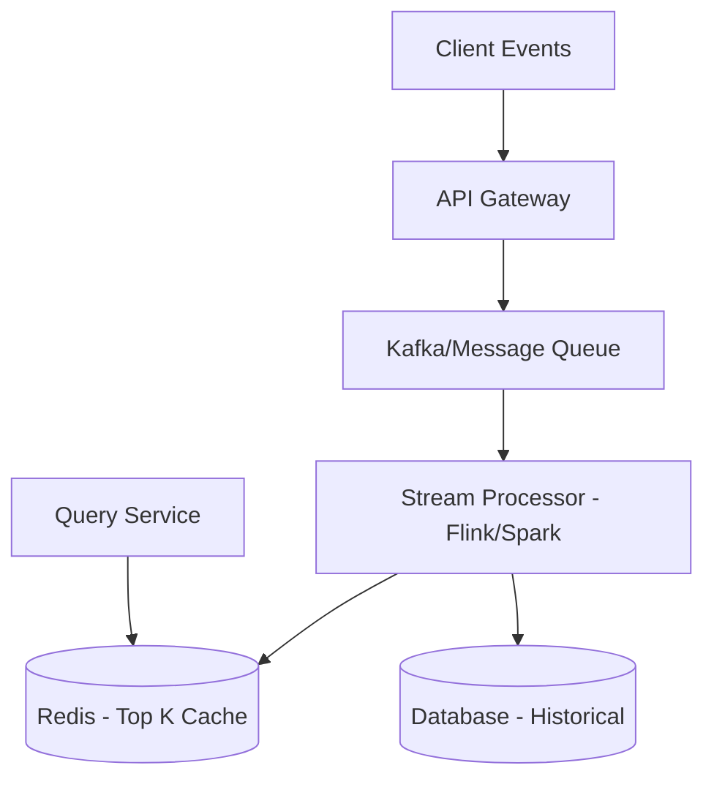

# Top 'K' Frequent Items (Heavy Hitters)

## 1. Requirements

### Functional
*   Track the most frequent items in a real-time stream (e.g., top trending hashtags on Twitter, most played songs on Spotify).
*   Provide the top 'K' items for a specific time window (e.g., last 1 minute, 1 hour, 1 day).

### Non-Functional
*   **Scalability:** Must handle millions of events per second.
*   **Low Latency:** Retrieval of Top 'K' should be near-instant.
*   **Accuracy vs. Efficiency:** Approximate counts are often acceptable in exchange for massive space savings (e.g., using Count-Min Sketch).

## 2. Capacity Estimation
*   **Traffic:** 10 million events per second.
*   **Storage:** If tracking 1 million unique items, a simple hash map would take ~100MB. However, for billion-scale items, we need probabilistic data structures.
*   **Bandwidth:** 10M events/sec * 100 bytes/event $\approx$ 1GB/s.

## 3. APIs
`GET /v1/top-k?k=10&window=1h`
*   **Response:** `{"items": [{"id": "item1", "count": 5000}, ...], "window": "1h"}`

## 4. DB Design
*   **In-Memory:** Redis (Sorted Sets) for real-time storage.
*   **Persistent:** Cassandra or DynamoDB for historical data.
*   **Schema:** `(item_id, count, window_timestamp)`.

## 5. HLD with Mermaid

## 6. Detailed Design

### Count-Min Sketch
To handle massive cardinality, we use a Count-Min Sketch (probabilistic data structure).
*   Uses a 2D array of counters and multiple hash functions.
*   Provides an upper bound on frequency with fixed memory.

### Heavy Keepers / Space Saving Algorithm
Used to track the actual IDs of the top items, as Count-Min Sketch only tracks counts.

### Data Aggregation
*   **Log Aggregator:** Collects logs from app servers.
*   **Stream Processing:** Groups items and updates counts in sliding windows.
*   **Merging Results:** Distributed nodes track local top-K; a central aggregator merges them to find the global top-K.

## 7. Bottlenecks
*   **Hot Keys:** A single very popular item can overwhelm a partition. Solution: Use sub-partitioning or local aggregation before sending to the global counter.
*   **Accuracy:** For small 'K', error rates must be strictly monitored.
*   **Memory:** Keeping many time windows in memory can be expensive.
