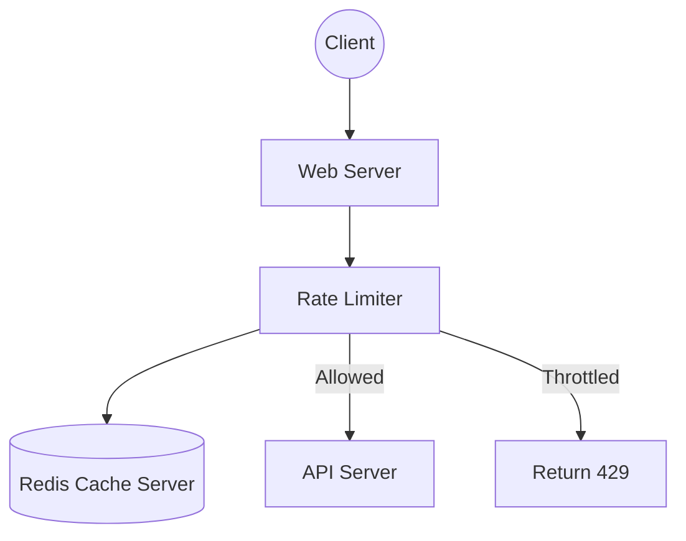

# API Rate Limiter Design

## 1. Requirements Clarifications

**Functional Requirements:**

- Limit the number of requests an entity can send to an API within a time window, e.g., 15 requests per second.
- The APIs are accessible through a cluster, so the rate limit should be considered across different servers. 
- The user should get an error message (HTTP 429 - Too many requests) whenever the defined threshold is crossed.

**Non-Functional Requirements:**

- The system should be highly available. The rate limiter should always work since it protects our service from external attacks.
- Our rate limiter should not introduce substantial latencies affecting the user experience.

## 2. Capacity Estimation and Constraints

If we assume a rate limit of 10 requests per second per user, and 1 million active users at any time, this would translate into 10 million QPS for our rate limiter. This is too much for a single server, so we need a distributed setup using a fast in-memory store like Redis or Memcached.

- **Storage Estimation:** Let's assume we use a "Sliding Window with Counters" approach. For each user, we store a count for each minute in the past hour. We need at max 60 entries per user. Using a Redis hash, this will require around 1.6KB per user. For 1 million users, we would need 1.6GB of memory (`1.6KB * 1 million ~= 1.6GB`). 

## 3. System APIs

The rate limiter itself is usually an internal service or middleware rather than a public API, but the interface exposed to the application server could be:

`isAllowed(api_dev_key, user_id, api_endpoint)`

**Parameters:**

- `api_dev_key` (string): The API developer key.
- `user_id` (string): The user making the request.
- `api_endpoint` (string): The endpoint being accessed.

**Returns:** (boolean)
Returns true if the request is within the limit, otherwise false.

## 4. Database Design

We need an extremely fast, in-memory data store. A NoSQL key-value store like **Redis** is ideal because:

- It operates in memory, providing sub-millisecond latencies.
- It supports advanced data structures like Hashes and Sorted Sets.
- It provides atomic operations and time-to-live (TTL) for keys.

## 5. High Level Design

When a client sends a request, the Web Server asks the Rate Limiter if the request should be served or throttled. If allowed, it is passed to the API servers.



## 6. Detailed Component Design

**Algorithms for Rate Limiting:**

1. *Fixed Window Algorithm:* Simple, but has the "boundary problem" where a user can send twice the allowed rate if they time requests around the minute boundary.
2. *Sliding Window Algorithm:* Uses a Redis Sorted Set to store timestamps of each request. Solves the boundary problem but is memory-intensive.
3. *Sliding Window with Counters (Hybrid):* Keep a count for each minute and calculate the sum of all counters in the past hour. We store counters in a Redis Hash. When a request increments a counter, it also sets the hash to expire an hour later. This uses 86% less memory than the simple sliding window.

**Atomicity and Concurrency:**
In a distributed environment, the “read-and-then-write” behavior can create a race condition. If two processes concurrently read the count before updating, they might both allow a request that should be throttled.

- *Solution:* Use Redis locks (Redlock) or use Redis `INCR` operations which are inherently atomic.

## 7. Identifying and Resolving Bottlenecks

**Data Sharding and Caching:**
We can shard based on the `UserID` using Consistent Hashing to distribute the user’s data across multiple Redis nodes. We can also use a **Write-back cache** in the Rate Limiter servers, updating all counters in local cache first and syncing to permanent storage at fixed intervals to ensure minimum latency.

**Should we rate limit by IP or by user?**

- *IP:* Easy to implement but problematic when multiple users share a single public IP (e.g., internet cafe). Also, IPv6 makes it trivial for attackers to cycle through addresses.
- *User:* More accurate, but a hacker can perform a denial of service attack against a user by entering wrong credentials up to the limit.
- *Hybrid:* The best approach is to do both per-IP and per-user rate limiting.

## Likely Follow-Up Questions

??? "How do you handle distributed rate limiting across multiple servers?"

    Rate limiting must be consistent across all servers in a cluster:

    - **Centralized store**: Use Redis or Memcached as single source of truth for request counts.
    - **Eventual consistency**: Each server caches locally; periodically syncs with Redis. Acceptable <1% over-limit.
    - **Atomic operations**: Use Redis INCR to atomically increment counters; Redis Lua scripts for complex logic.
    - **Sharding**: Shard Redis by user_id to avoid hot keys; 10+ Redis nodes for redundancy.
    - **Replication**: Replicate Redis data; if master fails, promote replica to master.

    Trade-off: Centralized Redis adds latency (~10ms per request); worth it for correctness.

??? "What algorithm is best for different use cases?"

    Different algorithms have different trade-offs:

    | Algorithm | Accuracy | Latency | Memory | Use Case |
    | :--- | :--- | :--- | :--- | :--- |
    | **Token Bucket** | Good | Fast | Low | APIs with bursty traffic; allows burst overages. |
    | **Leaky Bucket** | Excellent | Medium | Medium | Smooth traffic shaping; rejects all overages. |
    | **Fixed Window** | Poor (boundary spike) | Very Fast | Very Low | Simple limits; acceptable for non-critical APIs. |
    | **Sliding Window** | Excellent | Slow | High | Accurate limiting; best for strict SLAs. |

    Recommendation: Start with token bucket; migrate to sliding window if accuracy critical.

??? "How do you communicate rate limit info to clients?"

    Clients need to know their quota and remaining requests:

    - **Headers**: Return `X-RateLimit-Limit`, `X-RateLimit-Remaining`, `X-RateLimit-Reset`.
    - **429 response**: Include Retry-After header with seconds to wait.
    - **Dashboard**: Show users their quota, current usage, and historical trends.
    - **Warnings**: Alert users when approaching limit (e.g., 80% used).
    - **Progressive backoff**: Clients implement exponential backoff (wait 1s, 2s, 4s) on 429 responses.

    Example header:
    ```
    X-RateLimit-Limit: 1000
    X-RateLimit-Remaining: 234
    X-RateLimit-Reset: 1371337925
    ```