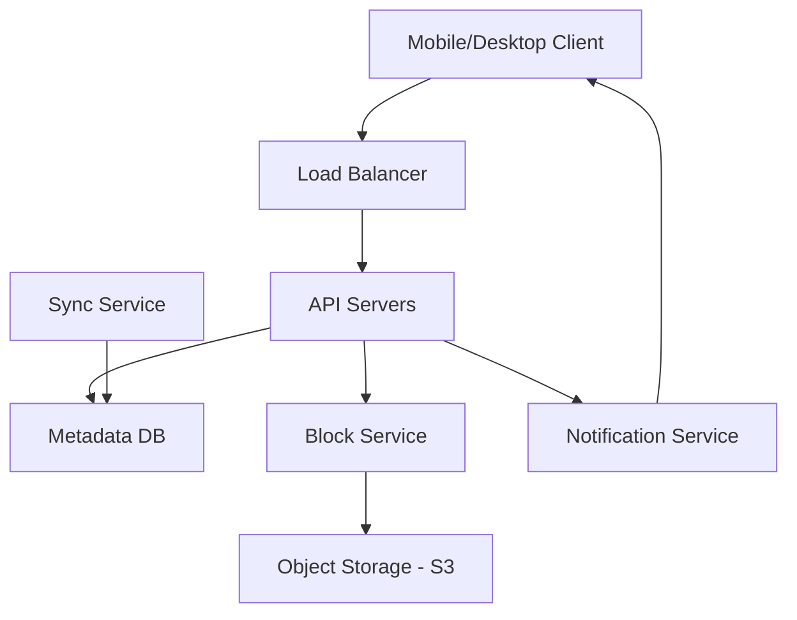

# Case Study: Dropbox / Google Drive

## 1. Requirements

### Functional
*   Users can upload and download files from any device.
*   File synchronization across multiple devices.
*   File versioning and history (recovery).
*   Sharing files and folders with other users.

### Non-Functional
*   **Durability:** Data should not be lost (99.999999999% durability).
*   **Availability:** High availability for file access.
*   **Efficiency:** Minimize bandwidth usage (incremental updates).

## 2. Capacity Estimation
*   **Users:** 500M total, 10M daily active users (DAU).
*   **Storage:** Average 10GB per user $\rightarrow$ 5 Exabytes total storage.
*   **Traffic:** 100M file uploads/updates per day.

## 3. APIs
*   `uploadFile(file_data, metadata)`
*   `downloadFile(file_id, version)`
*   `listUpdates(cursor)` (used by clients for sync)

## 4. DB Design
*   **Metadata DB:** Relational (MySQL/PostgreSQL) for ACID properties.
    *   `User (user_id, name, email)`
    *   `File (file_id, name, path, is_directory, parent_id, latest_version)`
    *   `FileVersion (version_id, file_id, device_id, checksum, size, timestamp)`
*   **Block Storage:** Amazon S3 or similar object store for actual file chunks.

## 5. HLD with Mermaid

## 6. Detailed Design

### Block Level Storage
Files are split into fixed-size chunks (e.g., 4MB). Only modified chunks are re-uploaded.
*   **Deduplication:** Checksums (SHA-256) are used to identify identical blocks across the entire system to save space.

### Client-Side Sync
The client keeps a local database (SQLite) to track file states.
*   **Chunking:** Files are chunked locally.
*   **Watchdog:** Monitors local file changes.
*   **Differential Sync:** Only sends the delta (modified blocks).

### Metadata Cache
To speed up lookups, metadata for active users is cached in Redis.

## 7. Bottlenecks
*   **Metadata DB Scaling:** As the number of files grows into trillions, sharding the Metadata DB becomes necessary.
*   **Notification Latency:** Ensuring real-time sync across devices requires a robust Long Polling or WebSocket-based notification service.
*   **Upload Speed:** Use Edge locations (CDNs) to terminate connections closer to the user.
