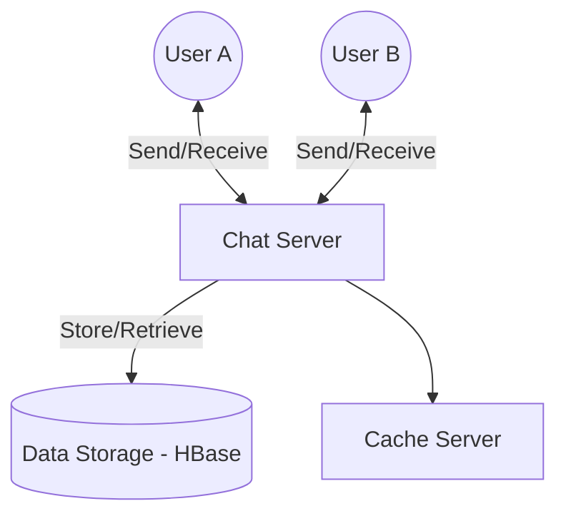

# Facebook Messenger Design

## 1. Requirements Clarifications

**Functional Requirements:**
1. Messenger should support one-on-one conversations between users.
2. Messenger should keep track of the online/offline statuses of its users.
3. Messenger should support persistent storage of chat history.

**Non-Functional Requirements:**
1. Users should have real-time chat experience with minimum latency.
2. Our system should be highly consistent; users should be able to see the same chat history on all their devices.
3. Messenger’s high availability is desirable; we can tolerate lower availability in the interest of consistency.

**Extended Requirements:**
- Group Chats: Messenger should support multiple people talking to each other in a group.
- Push notifications: Messenger should be able to notify users of new messages when they are offline.

## 2. Capacity Estimation and Constraints

Let’s assume that we have 500 million daily active users and on average each user sends 40 messages daily; this gives us 20 billion messages per day.

- **Storage Estimation:** Let’s assume that on average a message is 100 bytes, so to store all the messages for one day we would need 2TB of storage (`20 billion messages * 100 bytes => 2 TB/day`). To store five years of chat history, we would need 3.6 petabytes of storage (`2 TB * 365 days * 5 years ~= 3.6 PB`).
- **Bandwidth Estimation:** If our service is getting 2TB of data every day, this will give us 25MB of incoming data for each second (`2 TB / 86400 sec ~= 25 MB/s`). Since each incoming message needs to go out to another user, we will need the same amount of bandwidth 25MB/s for both upload and download.

## 3. System APIs

We can define APIs to send messages and retrieve messages. For sending a message:

`sendMessage(api_dev_key, user_id, receiver_id, message_text, media_ids)`

**Parameters:**
- `api_dev_key` (string): The API developer key of a registered account.
- `user_id` (number): The ID of the sender.
- `receiver_id` (number): The ID of the receiver.
- `message_text` (string): The text of the message.
- `media_ids` (number[]): Optional list of media_ids to be associated with the message.

**Returns:** (JSON)
Returns the message ID and delivery status.

## 4. Database Design

We need to store users, chats, and messages.

Which storage system should we use? We need to have a database that can support a very high rate of small updates and also fetch a range of records quickly. 

We cannot use RDBMS like MySQL or NoSQL like MongoDB because we cannot afford to read/write a row from the database every time a user receives/sends a message. This will not only make the basic operations of our service run with high latency, but also create a huge load on databases.

Both of our requirements can be easily met with a wide-column database solution like **HBase**. HBase is a column-oriented key-value NoSQL database that can store multiple values against one key into multiple columns. HBase groups data together to store new data in a memory buffer and, once the buffer is full, it dumps the data to the disk. This helps in storing a lot of small data quickly, and fetching rows by the key or scanning ranges of rows.

## 5. High Level Design

At a high-level, we will need a chat server that will be the central piece, orchestrating all the communications between users. 

**Detailed Workflow:**
1. User-A sends a message to User-B through the chat server.
2. The server receives the message and sends an acknowledgment to User-A.
3. The server stores the message in its database and sends the message to User-B.
4. User-B receives the message and sends the acknowledgment to the server.
5. The server notifies User-A that the message has been delivered successfully to User-B.

## 6. Detailed Component Design

**Messages Handling:**
To get a message from the server, the user can use the **Push model**, where users keep a connection open with the server (e.g., using **WebSockets** or **Long Polling**) and depend upon the server to notify them whenever there are new messages.
The chat server will find the server that holds the connection for the receiver and pass the message to that server to send it to the receiver. The chat server can then send the acknowledgment to the sender.

**Sequencing:**
To ensure correct ordering of messages for clients, we need to keep a sequence number with every message for each client. This sequence number will determine the exact ordering of messages for EACH user.

**Managing user’s status:**
We need to keep track of user’s online/offline status and notify all the relevant users whenever a status change happens. We can broadcast online status with a delay of a few seconds, pull the status of friends periodically, and only send status updates for users visible in the viewport.

## 7. Identifying and Resolving Bottlenecks

**Data Partitioning:**
- *Partitioning based on UserID:* We can partition based on the hash of the UserID so that we can keep all messages of a user on the same database. We can find the shard number by `hash(UserID) % 1000`.

**Cache:**
We can cache a few recent messages (say last 15) in a few recent conversations that are visible in a user’s viewport (say last 5). Since we decided to store all of the user’s messages on one shard, cache for a user should entirely reside on one machine too.

**Load balancing:**
We will need a load balancer in front of our chat servers; that can map each UserID to a server that holds the connection for the user and then direct the request to that server.

**Fault tolerance and Replication:**
If a chat server goes down, clients can automatically reconnect to transfer those connections to some other server. Messages should be stored with multiple copies of the data on different servers (or using Reed-Solomon encoding) to distribute and replicate it for fault tolerance.
