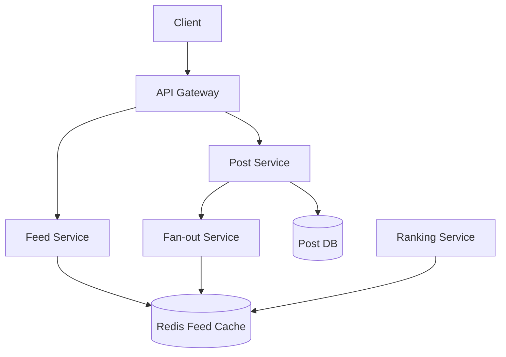

# Case Study: Facebook Newsfeed

## 1. Requirements clarifications (Functional & Non-Functional)

### Functional
*   Users see a feed of posts from friends and followed pages.
*   Users can post updates (text, image, video).
*   Real-time or near-real-time delivery of updates.
*   Ranking/Sorting (most recent vs. top stories).

### Non-Functional
*   **Low Latency:** Feed generation should take < 200ms.
*   **Scalability:** Support billions of users and millions of posts per day.
*   **Availability:** Feed should be accessible even if some services are down.

## 2. System interface definition (APIs)
*   `getFeed(user_id, count, cursor)`
*   `postStatus(user_id, text, media_ids)`

## 3. Back-of-the-envelope estimation (Capacity Estimation)
*   **Users:** 2B total, 500M DAU.
*   **Feed Content:** Each user follows ~500 entities.
*   **Traffic:** 500M users * 20 feed refreshes/day $\rightarrow$ 10B refreshes/day.
*   **Write Traffic:** 100M posts/day.

## 4. Defining data model (Database Schema/Model)
*   **User DB:** Relational (MySQL with Sharding) for profiles/friendships.
*   **Post DB:** NoSQL (Cassandra/HBase) for high write throughput.
*   **Feed Store:** In-memory (Redis) for pre-generated feeds.
    *   `Key: user_id, Value: List of [post_id, timestamp]`

## 5. High-level design (with Mermaid)

## 6. Detailed design (Deep dive into components)

### Feed Generation Strategies
1.  **Pull (Fan-out on Load):** Keep posts in a DB. When a user requests their feed, query all friends' posts and merge. *Issue: Very slow for users with many friends.*
2.  **Push (Fan-out on Write):** When a post is made, immediately push it to the pre-generated feeds of all followers in Redis. *Issue: "Celebrity Problem" (millions of followers).*
3.  **Hybrid:** Use Push for normal users and Pull for celebrities.

### Ranking Algorithm
Feeds aren't just chronological. Scores are calculated based on:
*   **Affinity:** How often the user interacts with the author.
*   **Weight:** Type of post (video > photo > text).
*   **Time Decay:** Newer posts are more relevant.

### Feed Cache Sharding
Shard the Redis cluster by `user_id` to ensure that a single user's feed is always on one node.

## 7. Identifying and resolving bottlenecks (Scaling/Bottlenecks)
*   **Celebrity Fan-out:** Handling users with 10M+ followers requires dedicated workers and asynchronous processing.
*   **Cache Eviction:** Keeping feeds for 2B users in RAM is expensive. Use LRU eviction for inactive users.
*   **Media Storage:** Images and videos require a CDN and optimized blob storage.

## Likely Follow-Up Questions

<strong>How do you ensure feed staleness is acceptable to users?</strong>

Feed staleness (delay before new post appears) affects user experience:

- **Push staleness**: With push fan-out, post appears within 100-500ms (network + Redis update latency).
- **Pull staleness**: With pull fan-out, staleness depends on cache TTL (0-5 minutes).
- **User tolerance**: Users tolerate 1-2 second delays; >5 seconds feels broken.
- **Eventual consistency**: For normal posts, show within 100ms. For sensitive content (policy violations), delay review (24hr OK).
- **Monitoring**: Track p50, p99 staleness; alert if >1s consistently.

Strategy: Use push for fast posts; async indexing for search/archival (can be slower).

<strong>How do you handle real-time notifications alongside feed updates?</strong>

Notifications inform users of likes, comments, and new posts from close friends:

- **Real-time delivery**: Notifications sent via WebSocket or long-polling; appear immediately.
- **Persistence**: Store notifications in database for 30 days; queryable via API if user was offline.
- **Batching**: Don't notify user for every like; batch into "5 people liked your post" after 5 minutes.
- **Filtering**: Don't notify for posts you've already seen in feed; use deduplication.
- **Importance**: Distinguish urgent (messages from friends) vs casual (stranger liked post).

Architecture: Separate notification service listening to post/like/comment events; push via Kafka to notification delivery service.

<strong>What happens when ranking service is slow or down?</strong>

Ranking is computationally expensive (ML models); failures degrade gracefully:

- **Fallback**: If ranking times out, serve posts in reverse chronological order.
- **Cache**: Pre-compute rankings for top users hourly; serve cached rankings if ranking service down.
- **Approximation**: Use simpler ranking (likes count only) instead of full ML model when under load.
- **Circuit breaker**: If ranking fails >5% of requests, disable ranking; use chronological order.
- **Monitoring**: Track ranking latency; alert if >500ms (target <100ms).

Result: Feed always available, just less personalized during ranking issues.

