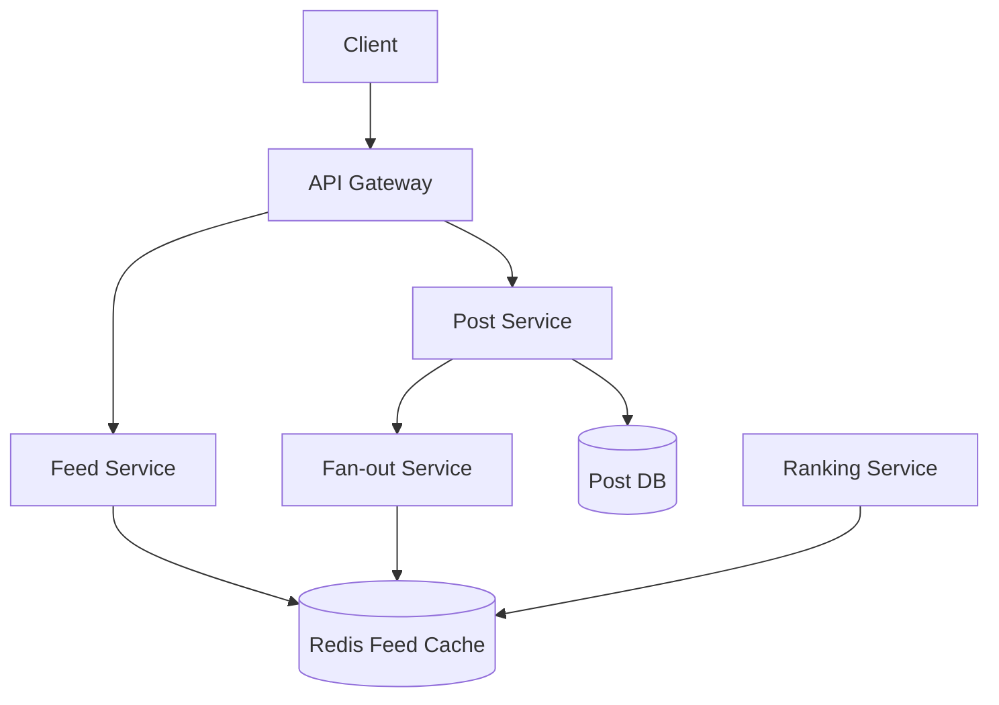

# Case Study: Facebook Newsfeed

## 1. Requirements

### Functional
*   Users see a feed of posts from friends and followed pages.
*   Users can post updates (text, image, video).
*   Real-time or near-real-time delivery of updates.
*   Ranking/Sorting (most recent vs. top stories).

### Non-Functional
*   **Low Latency:** Feed generation should take < 200ms.
*   **Scalability:** Support billions of users and millions of posts per day.
*   **Availability:** Feed should be accessible even if some services are down.

## 2. Capacity Estimation
*   **Users:** 2B total, 500M DAU.
*   **Feed Content:** Each user follows ~500 entities.
*   **Traffic:** 500M users * 20 feed refreshes/day $\rightarrow$ 10B refreshes/day.
*   **Write Traffic:** 100M posts/day.

## 3. APIs
*   `getFeed(user_id, count, cursor)`
*   `postStatus(user_id, text, media_ids)`

## 4. DB Design
*   **User DB:** Relational (MySQL with Sharding) for profiles/friendships.
*   **Post DB:** NoSQL (Cassandra/HBase) for high write throughput.
*   **Feed Store:** In-memory (Redis) for pre-generated feeds.
    *   `Key: user_id, Value: List of [post_id, timestamp]`

## 5. HLD with Mermaid

## 6. Detailed Design

### Feed Generation Strategies
1.  **Pull (Fan-out on Load):** Keep posts in a DB. When a user requests their feed, query all friends' posts and merge. *Issue: Very slow for users with many friends.*
2.  **Push (Fan-out on Write):** When a post is made, immediately push it to the pre-generated feeds of all followers in Redis. *Issue: "Celebrity Problem" (millions of followers).*
3.  **Hybrid:** Use Push for normal users and Pull for celebrities.

### Ranking Algorithm
Feeds aren't just chronological. Scores are calculated based on:
*   **Affinity:** How often the user interacts with the author.
*   **Weight:** Type of post (video > photo > text).
*   **Time Decay:** Newer posts are more relevant.

### Feed Cache Sharding
Shard the Redis cluster by `user_id` to ensure that a single user's feed is always on one node.

## 7. Bottlenecks
*   **Celebrity Fan-out:** Handling users with 10M+ followers requires dedicated workers and asynchronous processing.
*   **Cache Eviction:** Keeping feeds for 2B users in RAM is expensive. Use LRU eviction for inactive users.
*   **Media Storage:** Images and videos require a CDN and optimized blob storage.
