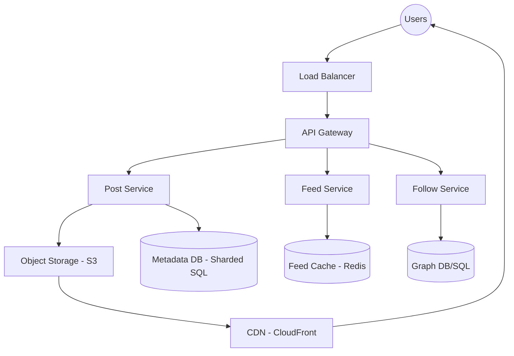

# Case Study: Designing a Photo-Sharing Service (Instagram)

This guide provides a comprehensive system design for a large-scale photo-sharing service, focusing on content delivery, feed generation, and high availability.

## 1. Requirements Clarifications

### Functional Requirements
- **Media Upload**: Users can upload photos and videos.
- **Follow System**: Users can follow other users.
- **News Feed**: Users can view a feed of photos/videos from people they follow.
- **Likes and Comments**: Users can interact with posts.
- **Search**: Users can search for other users or posts by hashtags/locations.

### Non-Functional Requirements
- **High Availability**: The system must be highly available (99.99%).
- **Reliability**: Any uploaded photo or video should never be lost.
- **Low Latency**: The news feed generation and media viewing should be near-instant (sub-200ms).
- **Eventual Consistency**: It is acceptable if a user sees a "like" count that is slightly outdated for a few seconds.
- **Scalability**: Support 500 million Daily Active Users (DAU).

---

## 2. Capacity Estimation and Constraints

### Traffic Estimates
- **Total Users**: 1 Billion.
- **Daily Active Users (DAU)**: 500 Million.
- **New Posts**: Assume 1 million new posts per day.
- **Read/Write Ratio**: Extremely read-heavy (users view far more than they post).

### Storage Estimates
- **Avg Photo Size**: 5 MB.
- **Daily Storage (Photos)**: $1M \times 5MB = 5 \text{ Terabytes/day}$.
- **5-Year Storage**: $5TB \times 365 \times 5 \approx 9 \text{ Petabytes}$.
- **Metadata Storage**: User data, follows, and post metadata will require several Terabytes of structured storage.

---

## 3. System APIs

We can use GraphQL or REST. Below are the core RESTful endpoints.

### Upload Post
```http
POST /api/v1/post
Content-Type: multipart/form-data

{
  "user_id": "string",
  "media_data": "file",
  "location": "string (optional)",
  "caption": "string (optional)"
}
```
**Returns**: `201 Created` with the `post_id`.

### Get News Feed
```http
GET /api/v1/feed?user_id={id}&count={count}&offset={offset}
```
**Returns**: A JSON list of post objects, including media URLs and metadata.

---

## 4. Database Design

A hybrid approach is required to handle relational data and high-velocity interactions.

### Schema

#### Users Table (SQL - Sharded PostgreSQL)
| Column Name | Type | Description |
| :--- | :--- | :--- |
| **user_id** (PK) | int | Unique ID |
| **username** | varchar(32) | Unique username |
| **email** | varchar(128) | User email |
| **created_at** | timestamp | Join date |

#### Posts Table (SQL - Sharded PostgreSQL)
| Column Name | Type | Description |
| :--- | :--- | :--- |
| **post_id** (PK) | int | Unique ID |
| **user_id** | int | Author ID |
| **media_path** | varchar(255) | S3 URL/Object key |
| **caption** | text | Post description |
| **created_at** | timestamp | Upload time |

#### Likes Table (NoSQL - Cassandra)
*Chosen for high write throughput and scalability.*
- `post_id` (Partition Key)
- `user_id` (Clustering Key)
- `timestamp`

---

## 5. High Level Design



---

## 6. Detailed Component Design

### News Feed Generation
This is the most complex part of the system. There are three main strategies:

1. **Pull Model (Fan-out on Load)**:
   - When a user refreshes their feed, the system fetches all "follows", gets their latest posts, and sorts them.
   - **Problem**: Slow for users following many people.

2. **Push Model (Fan-out on Write)**:
   - When a user posts, we find all their followers and push the post ID into their pre-generated "Feed Cache" (Redis).
   - **Problem**: "Celebrity" problem. If a celebrity with 50M followers posts, pushing to 50M caches causes a massive spike.

3. **Hybrid Model (Recommended)**:
   - **Regular users**: Use the **Push** model.
   - **Celebrities**: Use the **Pull** model. Followers of celebrities fetch celebrity posts at query time and merge them with their pre-cached feed.

### Media Storage and Delivery
- **Storage**: Photos/Videos are stored in **Amazon S3** (or similar object storage).
- **Optimization**: Images are resized into different resolutions (Thumbnail, Mobile, Desktop) upon upload.
- **Delivery**: A **CDN (Content Delivery Network)** is used to cache media at edge locations close to users, drastically reducing latency.

---

## 7. Identifying and Resolving Bottlenecks

### Data Sharding
Since a single DB instance cannot hold all post metadata, we shard the data.
- **Shard by UserID**: All posts for a user live on one shard.
- **Pros**: Fast to fetch a user's profile.
- **Cons**: "Hot" users can overwhelm a single shard.

### Caching Strategy
- **Redis/Memcached**: Store the News Feed for the last 72 hours for active users.
- **Write-around Cache**: For metadata to keep the database from being the bottleneck on reads.

### Handling "Hot" Content
- Popular posts (viral content) are cached aggressively in global CDNs and regional caches to prevent origin server overload.

### Load Balancing
- Use multiple LBs at different layers: Global (DNS-based) and Local (Layer 7 software LBs like NGINX).
