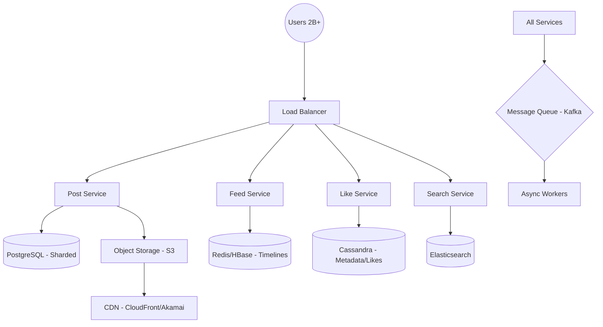

# Instagram Design

## Problem Statement

Design a social media platform where users can:
- Upload photos and videos
- Follow other users
- Like and comment on posts
- View feed of followed users

## Key Challenges

1. **Scalability**: 2+ billion users, 95M+ uploads daily
2. **Feed Generation**: Fast timeline generation for millions
3. **Real-time Updates**: Live notifications and activity

## Architecture Overview



## Data Model

**Users Table (PostgreSQL)**
- id, username, email, bio, avatar_url, followers_count, following_count

**Posts Table (PostgreSQL)**
- id, user_id, caption, image_url, video_url, created_at, like_count, comment_count

**Feed/Timeline (Redis)**
- user_id, post_id, created_at (Denormalized for fast reads)

**Follows (PostgreSQL)**
- follower_id, following_id, created_at

## Estimation

```
DAU: 500M
Posts/day: 95M (0.19 posts per user)
Photos/video sizes: 5MB average
Storage needed: 95M * 5MB * 365 * 5 years = 8.6 Exabytes
```

## Key Decisions

- **Client Interaction**: Uses **GraphQL** for efficient data fetching, allowing the mobile app to request only the specific fields needed for a view.
- **Feed Generation (Push vs. Pull)**: 
  - **Pull Model (Fan-out on Read)**: For celebrities with millions of followers. Followers fetch the celebrity's posts only when they refresh their feed.
  - **Push Model (Fan-out on Write)**: For regular users. When a post is created, it is pushed to all followers' timelines in Redis.
- **Data Storage Strategy**:
  - **PostgreSQL** handles structured user data and relational integrity.
  - **Cassandra** is used for "Likes" and "Stories" due to its high-write throughput and horizontal scalability.
- **Image Storage**: S3 with CDN
  - Automatic resizing for different devices
  - Compression for bandwidth
- **CAP Theorem Trade-offs**: Prioritizes **Availability** over Consistency (AP system). It is acceptable for a "Like" count to be eventually consistent across different regions.
