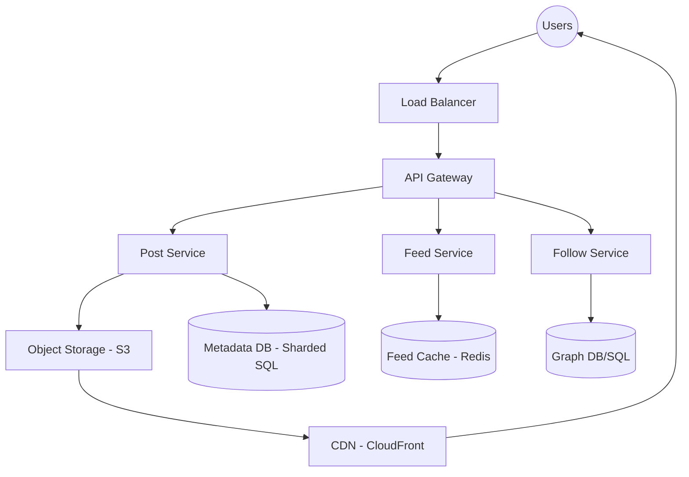

# Case Study: Designing a Photo-Sharing Service (Instagram)

This guide provides a comprehensive system design for a large-scale photo-sharing service, focusing on content delivery, feed generation, and high availability.

## 1. Requirements clarifications (Functional & Non-Functional)

### Functional Requirements
- **Media Upload**: Users can upload photos and videos.
- **Follow System**: Users can follow other users.
- **News Feed**: Users can view a feed of photos/videos from people they follow.
- **Likes and Comments**: Users can interact with posts.
- **Search**: Users can search for other users or posts by hashtags/locations.

### Non-Functional Requirements
- **High Availability**: The system must be highly available (99.99%).
- **Reliability**: Any uploaded photo or video should never be lost.
- **Low Latency**: The news feed generation and media viewing should be near-instant (sub-200ms).
- **Eventual Consistency**: It is acceptable if a user sees a "like" count that is slightly outdated for a few seconds.
- **Scalability**: Support 500 million Daily Active Users (DAU).

---

## 2. System interface definition (APIs)

We can use GraphQL or REST. Below are the core RESTful endpoints.

### Upload Post
```http
POST /api/v1/post
Content-Type: multipart/form-data

{
  "user_id": "string",
  "media_data": "file",
  "location": "string (optional)",
  "caption": "string (optional)"
}
```
**Returns**: `201 Created` with the `post_id`.

### Get News Feed
```http
GET /api/v1/feed?user_id={user_id}&count={count}&offset={offset}
```
**Returns**: A JSON list of post objects, including media URLs and metadata.

---

## 3. Back-of-the-envelope estimation (Capacity Estimation)

### Traffic Estimates
- **Total Users**: 1 Billion.
- **Daily Active Users (DAU)**: 500 Million.
- **New Posts**: Assume 1 million new posts per day.
- **Read/Write Ratio**: Extremely read-heavy (users view far more than they post).

### Storage Estimates
- **Avg Photo Size**: 5 MB.
- **Daily Storage (Photos)**: $1M \times 5MB = 5 \text{ Terabytes/day}$.
- **5-Year Storage**: $5TB \times 365 \times 5 \approx 9 \text{ Petabytes}$.
- **Metadata Storage**: User data, follows, and post metadata will require several Terabytes of structured storage.

---

## 4. Defining data model (Database Schema/Model)

A hybrid approach is required to handle relational data and high-velocity interactions.

### Schema

#### Users Table (SQL - Sharded PostgreSQL)
| Column Name | Type | Description |
| :--- | :--- | :--- |
| **user_id** (PK) | int | Unique ID |
| **username** | varchar(32) | Unique username |
| **email** | varchar(128) | User email |
| **created_at** | timestamp | Join date |

#### Posts Table (SQL - Sharded PostgreSQL)
| Column Name | Type | Description |
| :--- | :--- | :--- |
| **post_id** (PK) | int | Unique ID |
| **user_id** | int | Author ID |
| **media_path** | varchar(255) | S3 URL/Object key |
| **caption** | text | Post description |
| **created_at** | timestamp | Upload time |

#### Likes Table (NoSQL - Cassandra)
*Chosen for high write throughput and scalability.*
- `post_id` (Partition Key)
- `user_id` (Clustering Key)
- `timestamp`

---

## 5. High-level design (with Mermaid)



---

## 6. Detailed design (Deep dive into components)

### News Feed Generation
This is the most complex part of the system. There are three main strategies:

1. **Pull Model (Fan-out on Load)**:
   - When a user refreshes their feed, the system fetches all "follows", gets their latest posts, and sorts them.
   - **Problem**: Slow for users following many people.

2. **Push Model (Fan-out on Write)**:
   - When a user posts, we find all their followers and push the post ID into their pre-generated "Feed Cache" (Redis).
   - **Problem**: "Celebrity" problem. If a celebrity with 50M followers posts, pushing to 50M caches causes a massive spike.

3. **Hybrid Model (Recommended)**:
   - **Regular users**: Use the **Push** model.
   - **Celebrities**: Use the **Pull** model. Followers of celebrities fetch celebrity posts at query time and merge them with their pre-cached feed.

### Media Storage and Delivery
- **Storage**: Photos/Videos are stored in **Amazon S3** (or similar object storage).
- **Optimization**: Images are resized into different resolutions (Thumbnail, Mobile, Desktop) upon upload.
- **Delivery**: A **CDN (Content Delivery Network)** is used to cache media at edge locations close to users, drastically reducing latency.

---

## 7. Identifying and resolving bottlenecks (Scaling/Bottlenecks)

### Data Sharding
Since a single DB instance cannot hold all post metadata, we shard the data.
- **Shard by UserID**: All posts for a user live on one shard.
- **Pros**: Fast to fetch a user's profile.
- **Cons**: "Hot" users can overwhelm a single shard.

### Caching Strategy
- **Redis/Memcached**: Store the News Feed for the last 72 hours for active users.
- **Write-around Cache**: For metadata to keep the database from being the bottleneck on reads.

### Handling "Hot" Content
- Popular posts (viral content) are cached aggressively in global CDNs and regional caches to prevent origin server overload.

### Load Balancing
- Use multiple LBs at different layers: Global (DNS-based) and Local (Layer 7 software LBs like NGINX).

## Interviewer Lens

Instagram is a media-heavy feed system, so it combines the hard parts of uploads, storage, delivery, and feed generation. A strong explanation separates the post pipeline from the feed pipeline and then explains how CDN caching, fan-out, and sharding interact at scale.

## Likely Follow-Up Questions

<details>
<summary><strong>How do you handle the celebrity fan-out problem?</strong></summary>

Celebrities with 100M+ followers create extreme write amplification:

- **Hybrid fan-out**: For normal users, fan-out on write (pre-compute feeds). For celebrities, fan-out on read.
- **Detection**: Use follower count threshold (e.g., >1M followers = celebrity). Switch strategy dynamically.
- **Separate storage**: Celebrity posts stored in separate partition optimized for range queries.
- **Read aggregation**: User's feed = 80% celebrity content (pulled on read) + 20% friend content (pre-computed).
- **Caching**: Cache celebrity posts at CDN edge; cache hit rate should be >99%.

Challenge: Consistency—when Kardashian posts, millions of feeds need to update. Eventual consistency (5-10s delay) is acceptable.

</details>

<details>
<summary><strong>What changes between photos, videos, and mixed media posts?</strong></summary>

Different media types have different storage and processing requirements:

- **Photos**: Stored in S3, processed through CDN, variable sizes (thumbnail, medium, high-res). Fast, cheap.
- **Videos**: Stored in S3, transcoded to multiple bitrates (360p, 720p, 1080p) for adaptive streaming. Expensive, slow (hours to transcode).
- **Mixed media**: Carousel with photos and videos; need to handle each item separately.
- **Timeline rendering**: Mixed feeds require careful layout; thumbnails for photos, video preview for videos.
- **Encoding queue**: Use Kafka or SQS to queue video transcoding; workers process asynchronously.
- **Processing time**: Photos: <5s. Videos: 10min to 1hr depending on size and quality.

Architecture: Separate pipelines for photos (fast CDN) and videos (transcoding workers).

</details>

<details>
<summary><strong>How do you keep likes and comments consistent enough for users?</strong></summary>

Likes and comments are high-volume, and eventual consistency causes confusion (user likes post, count doesn't increase for 10s):

- **Consistency level**: Use **strong consistency for comments** (important to order), **eventual consistency for likes** (only the count matters, not order).
- **Comments**: Stored in primary database, replicated synchronously to avoid reordering.
- **Likes**: Stored in eventually-consistent cache (Redis) + periodic sync to database. Eventual consistency (100ms lag) is acceptable.
- **Read-your-writes**: After user likes, show the like immediately in their UI (optimistic update); background sync to database.
- **Consistency window**: Guarantee consistency within 5 seconds; long-tail requests may see stale counts.

Implementation: Dual-write pattern—write like count to Redis + Kafka; consumer updates database eventually.

</details>

<details>
<summary><strong>What data should live in object storage versus the metadata database?</strong></summary>

Different data types have different access patterns and durability requirements:

| Data Type | Storage | Reason |
| :--- | :--- | :--- |
| **Photo/video files** | S3 (object storage) | Large blobs, immutable, append-only, durable, cost-effective. |
| **Post metadata** (caption, created_at, like_count) | PostgreSQL | Small, frequently updated, requires indexing and joins. |
| **User profile** | PostgreSQL | Transactional, consistent, indexed by username. |
| **Like counts** | Redis (cache) | Hot data, high read rate, eventual consistency OK. |
| **Comments** | PostgreSQL + Elasticsearch | Need ordering, search, and fast retrieval. |
| **Thumbnails** | CDN (cached from S3) | Frequently accessed, geographically distributed. |

Strategy: Use PostgreSQL for metadata, S3 for media, Redis for hot counts, Elasticsearch for search.

</details>

<details>
<summary><strong>How would you support search over users, hashtags, and locations?</strong></summary>

Search is a separate concern from the main feed system:

- **User search**: Index users by username in Elasticsearch. Prefix search (autocomplete): returns suggestions as user types.
- **Hashtag search**: Inverted index from hashtag to posts. Rank by post popularity (likes + comments).
- **Location search**: Geohashing or S2 cells for proximity. Search by location name (city, venue) or GPS coordinates.
- **Indexing delay**: Search indexes are updated asynchronously (10-60s lag), which is acceptable.
- **Ranking**: Rank search results by engagement (likes, comments, saves), freshness, and user's network.
- **Filtering**: Filter by date range, media type (photo vs video), follower count, etc.

Architecture: Separate Elasticsearch cluster for search; async indexing pipeline from main database.

</details>
