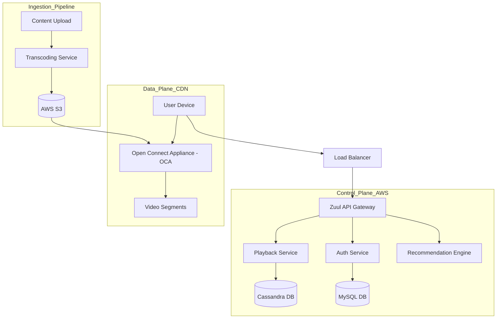

# Netflix System Design Case Study

This case study explores the architectural complexity of a global video streaming platform, focusing on massive scale, high availability, and the optimization of content delivery.

## 1. Requirements Clarifications

### Functional Requirements
*   **Video Playback:** Users can stream videos in various qualities (4K, HD, SD) without significant buffering.
*   **Discovery:** Users can search for titles and see personalized recommendations.
*   **Account Management:** Profile management, billing, and watch history.
*   **Offline Viewing:** Support for downloading content to local devices.

### Non-Functional Requirements
*   **Global Availability:** 99.99% uptime; low latency for users worldwide.
*   **Scalability:** Support 200M+ users and 100,000+ requests per second.
*   **Adaptive Bitrate (ABR):** Seamlessly adjust video quality based on network speed.
*   **Content Security:** Digital Rights Management (DRM) to prevent piracy.

---

## 2. Capacity Estimation and Constraints

### Traffic Assumptions
*   **Total Users:** 250 million.
*   **Daily Active Users (DAU):** 50 million.
*   **Average Watch Time:** 2 hours/day.
*   **Peak Traffic:** 5x the average.

### Storage & Bandwidth
*   **Video Library:** ~10,000 titles. Each title has multiple resolutions and bitrates.
*   **Storage per Title:** 1 title * 20 formats * 5GB (average) = 100GB per title.
*   **Total Library Storage:** 10,000 * 100GB = 1 PB.
*   **Egress Bandwidth:** 50M users * 2 hours * 1.5GB/hour (HD) = 150 PB/day. This is why a custom CDN (Open Connect) is critical.

---

## 3. System APIs

### Content & Playback APIs
*   `GET /v1/metadata/{video_id}`: Retrieves title info, cast, and thumbnails.
*   `GET /v1/stream/{video_id}`: Requests a streaming manifest (M3U8/MPD).
    *   *Returns:* List of available bitrates and URL segments for the nearest CDN node.

### User Service APIs
*   `POST /v1/history`: Updates "continue watching" progress.
*   `GET /v1/recommendations`: Returns a list of personalized titles.

---

## 4. Database Design

### Data Stores
1.  **Relational DB (MySQL):** For structured, critical data like Billing, User Accounts, and Subscription status.
2.  **NoSQL DB (Cassandra):** For massive, semi-structured data like Playback History, User Bookmarks, and Metadata. Cassandra’s masterless architecture is perfect for high-write global availability.
3.  **Search Engine (Elasticsearch):** For full-text search across titles, genres, and cast members.

### Schema (Cassandra - Playback History)
*   **Table:** `user_history`
*   **Columns:** `user_id (Partition Key)`, `video_id (Clustering Key)`, `last_played_timestamp`, `offset_seconds`, `device_id`.

---

## 5. High Level Design

---

## 6. Detailed Component Design

### Transcoding Pipeline
When a raw video is uploaded, it must be converted into thousands of "shards."
*   **Parallel Processing:** The video is split into small chunks (e.g., 2-5 seconds).
*   **Multi-Codec Encoding:** Chunks are encoded into multiple formats (H.264, HEVC, VP9) and bitrates to support every possible device (Mobile, TV, Web).
*   **Manifest Creation:** A manifest file is created to link all these chunks together.

### Open Connect (Custom CDN)
Instead of using third-party CDNs, Netflix installs its own hardware (OCAs) inside Internet Service Provider (ISP) data centers.
*   **Caching Strategy:** OCAs "pre-position" content during off-peak hours based on predicted local demand.
*   **Zero-Hop Delivery:** Since the content is inside the ISP's network, it travels a very short distance, reducing latency and ISP costs.

---

## 7. Identifying and Resolving Bottlenecks

### Availability and Resilience
*   **Multi-Region Deployment:** Netflix operates in multiple AWS regions. If one region fails (e.g., US-East-1), traffic is instantly rerouted to another.
*   **Chaos Engineering:** Using tools like "Chaos Monkey" to intentionally take down microservices in production to ensure the system handles failures gracefully.

### Caching and Performance
*   **Global Client Cache:** The client app caches metadata and images locally.
*   **Circuit Breakers:** Using Hystrix (or similar) to prevent a single slow service (like Recommendations) from dragging down the entire Control Plane. If Recommendations fail, the system falls back to a static "Trending" list.

### Database Scalability
*   **Cassandra Compaction:** Tuned to handle the high volume of write-heavy playback updates.
*   **Sharding:** MySQL databases are sharded by `user_id` to distribute load across multiple instances.
