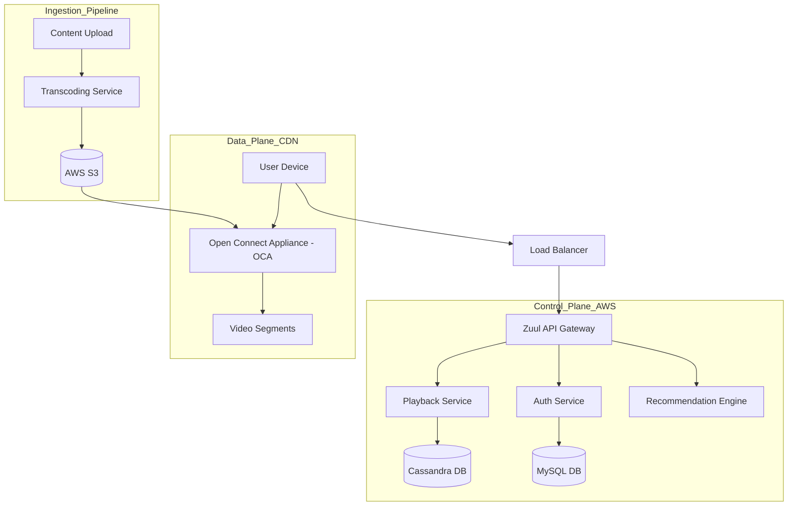

# Netflix System Design Case Study

This case study explores the architectural complexity of a global video streaming platform, focusing on massive scale, high availability, and the optimization of content delivery.

## 1. Requirements Clarifications

### Functional Requirements
*   **Video Playback:** Users can stream videos in various qualities (4K, HD, SD) without significant buffering.
*   **Discovery:** Users can search for titles and see personalized recommendations.
*   **Account Management:** Profile management, billing, and watch history.
*   **Offline Viewing:** Support for downloading content to local devices.

### Non-Functional Requirements
*   **Global Availability:** 99.99% uptime; low latency for users worldwide.
*   **Scalability:** Support 200M+ users and 100,000+ requests per second.
*   **Adaptive Bitrate (ABR):** Seamlessly adjust video quality based on network speed.
*   **Content Security:** Digital Rights Management (DRM) to prevent piracy.

---

## 2. Capacity Estimation and Constraints

### Traffic Assumptions
*   **Total Users:** 250 million.
*   **Daily Active Users (DAU):** 50 million.
*   **Average Watch Time:** 2 hours/day.
*   **Peak Traffic:** 5x the average.

### Storage & Bandwidth
*   **Video Library:** ~10,000 titles. Each title has multiple resolutions and bitrates.
*   **Storage per Title:** 1 title * 20 formats * 5GB (average) = 100GB per title.
*   **Total Library Storage:** 10,000 * 100GB = 1 PB.
*   **Egress Bandwidth:** 50M users * 2 hours * 1.5GB/hour (HD) = 150 PB/day. This is why a custom CDN (Open Connect) is critical.

---

## 3. System APIs

### Content & Playback APIs
*   `GET /v1/metadata/{video_id}`: Retrieves title info, cast, and thumbnails.
*   `GET /v1/stream/{video_id}`: Requests a streaming manifest (M3U8/MPD).
    *   *Returns:* List of available bitrates and URL segments for the nearest CDN node.

### User Service APIs
*   `POST /v1/history`: Updates "continue watching" progress.
*   `GET /v1/recommendations`: Returns a list of personalized titles.

---

## 4. Database Design

### Data Stores
1.  **Relational DB (MySQL):** For structured, critical data like Billing, User Accounts, and Subscription status.
2.  **NoSQL DB (Cassandra):** For massive, semi-structured data like Playback History, User Bookmarks, and Metadata. Cassandra’s masterless architecture is perfect for high-write global availability.
3.  **Search Engine (Elasticsearch):** For full-text search across titles, genres, and cast members.

### Schema (Cassandra - Playback History)
*   **Table:** `user_history`
*   **Columns:** `user_id (Partition Key)`, `video_id (Clustering Key)`, `last_played_timestamp`, `offset_seconds`, `device_id`.

---

## 5. High Level Design

---

## 6. Detailed Component Design

### Transcoding Pipeline
When a raw video is uploaded, it must be converted into thousands of "shards."
*   **Parallel Processing:** The video is split into small chunks (e.g., 2-5 seconds).
*   **Multi-Codec Encoding:** Chunks are encoded into multiple formats (H.264, HEVC, VP9) and bitrates to support every possible device (Mobile, TV, Web).
*   **Manifest Creation:** A manifest file is created to link all these chunks together.

### Open Connect (Custom CDN)
Instead of using third-party CDNs, Netflix installs its own hardware (OCAs) inside Internet Service Provider (ISP) data centers.
*   **Caching Strategy:** OCAs "pre-position" content during off-peak hours based on predicted local demand.
*   **Zero-Hop Delivery:** Since the content is inside the ISP's network, it travels a very short distance, reducing latency and ISP costs.

---

## 7. Identifying and Resolving Bottlenecks

### Availability and Resilience
*   **Multi-Region Deployment:** Netflix operates in multiple AWS regions. If one region fails (e.g., US-East-1), traffic is instantly rerouted to another.
*   **Chaos Engineering:** Using tools like "Chaos Monkey" to intentionally take down microservices in production to ensure the system handles failures gracefully.

### Caching and Performance
*   **Global Client Cache:** The client app caches metadata and images locally.
*   **Circuit Breakers:** Using Hystrix (or similar) to prevent a single slow service (like Recommendations) from dragging down the entire Control Plane. If Recommendations fail, the system falls back to a static "Trending" list.

### Database Scalability
*   **Cassandra Compaction:** Tuned to handle the high volume of write-heavy playback updates.
*   **Sharding:** MySQL databases are sharded by `user_id` to distribute load across multiple instances.

## Interviewer Lens

Netflix is a media delivery system with a control plane and a data plane, so the answer should make that split explicit. The most convincing discussion covers transcoding, bitrate adaptation, CDN placement, and failure recovery when a region or recommendation service is unavailable.

## Likely Follow-Up Questions

<strong>How does adaptive bitrate streaming react to a bad network?</strong>

Adaptive bitrate (ABR) streaming adjusts video quality in real-time based on available bandwidth:

- **Bandwidth detection**: Client measures throughput by monitoring download speed of 6-10s video chunks.
- **Quality selection**: Client picks bitrate that fits within detected bandwidth with headroom (e.g., use 70% of detected bandwidth).
- **Switching logic**: If throughput drops, switch to lower bitrate (720p → 480p). If improves, switch up (480p → 720p).
- **Startup**: Start with low bitrate (480p) to minimize buffering, then increase quality as chunks buffer.
- **Buffer size**: Maintain 30-60s of buffered content; pause playback if buffer < 5s.
- **Codec efficiency**: Use HEVC (H.265) instead of H.264 for 30-40% better compression.

Challenge: Balance between video quality and playback smoothness. Users prefer steady quality over frequent switching.

<strong>Why is a custom CDN better than relying only on third-party delivery?</strong>

Netflix's Open Connect CDN provides advantages over traditional CDNs:

- **Cost**: Netflix caches content at ISP datacenters, paying ISPs a one-time fee instead of per-GB delivery costs.
- **Control**: Netflix controls bitrates, caching policies, and content placement instead of relying on third-party SLAs.
- **Quality**: Direct ISP integration provides better streaming quality and fewer buffering interruptions.
- **Scale**: Open Connect handles 40%+ of North American internet traffic; third-party CDNs couldn't handle this volume cost-effectively.
- **Custom optimization**: Netflix can fine-tune encoding, chunk sizes, and push strategies per ISP/region.

Trade-off: Custom CDN requires partnerships with ISPs and significant operational overhead. Works for Netflix's scale; not practical for smaller companies.

<strong>How do you support offline viewing while keeping content secure?</strong>

Offline viewing requires downloading content to device while preventing piracy:

- **Licensing**: Each device-download pair is tied to a specific Netflix account. Download encrypted; license tied to account.
- **DRM (Digital Rights Management)**: Videos encrypted with AES-128; decryption key stored securely on device.
- **License expiration**: Downloaded content expires after 30 days (for subscription content) or shorter for rentals.
- **Device binding**: License tied to device; can't copy encrypted file to another device and play.
- **Secure storage**: Download cached in app's sandbox directory, not accessible to other apps.
- **Revocation**: If account is suspended, downloaded licenses are invalidated (periodic online check required).

Challenge: Balancing user convenience (long offline window) with security (preventing piracy).

<strong>What data belongs in Cassandra versus MySQL versus search?</strong>

Different data types have different access patterns:

| Data | Storage | Reason |
| :--- | :--- | :--- |
| **User account, subscription** | MySQL | Transactional, strong consistency, indexed by user_id. |
| **Playback history** | Cassandra | High write throughput, time-series data, eventual consistency OK. |
| **Recommendations** | Redis/cache | Hot data, frequently accessed, fast retrieval. |
| **Search (titles, genres)** | Elasticsearch | Full-text search, faceted filtering, ranking. |
| **Real-time metrics** | Kafka + Druid | Event streaming, time-series analysis, real-time dashboards. |

Design: Write playback events to Cassandra; async process into recommendations engine; serve from Redis.

<strong>What happens if recommendations are down during playback?</strong>

Graceful degradation when recommendation service fails:

- **Cache fallback**: Use cached recommendations from previous call (5min-1hr old).
- **Default recommendations**: Show trending shows, new releases, or popular by genre if cache miss.
- **Trending**: Pre-compute and cache trending content every hour; serves as fallback.
- **Manual curation**: Maintain hand-curated lists for top genres; always available even if ML is down.
- **Partial degradation**: If recommendation service is slow (>500ms), timeout and use fallback.
- **Circuit breaker**: If recommendation service fails 5 times in a row, circuit breaker opens; use fallback for 1 minute, then retry.
- **Monitoring**: Alert if recommendation success rate drops below 99%.

Result: User always sees something to watch, even if recommendations aren't personalized.

## Trade-Offs To Call Out

- The control plane can tolerate some delay, but the data plane must stay fast and globally available.
- Transcoding increases upfront processing cost, but it reduces playback failures and device incompatibility.
- A custom CDN improves latency and bandwidth costs, but it adds operational complexity.
- Eventual consistency is fine for recommendations and history, but not for entitlement checks or billing.
- Circuit breakers protect playback from cascading failures when auxiliary services degrade.
