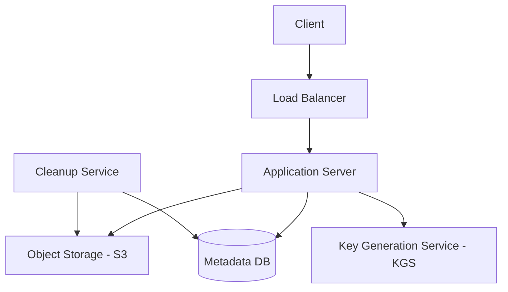

# Case Study: Pastebin

## 1. Requirements

### Functional
*   Users can "paste" text and get a unique URL.
*   Users can set expiration times for pastes (e.g., 1 hour, 1 day, never).
*   Pastes can be public or private.
*   (Optional) Support for syntax highlighting and custom aliases.

### Non-Functional
*   **Scalability:** Support millions of new pastes daily.
*   **Availability:** High availability for reading pastes.
*   **Low Latency:** Pastes should be accessible instantly.
*   **Durability:** Data should not be lost unless it expires.

## 2. Capacity Estimation
*   **Write Traffic:** 1 million pastes/day $\approx$ 12 pastes/sec.
*   **Read Traffic:** 10 million reads/day $\rightarrow$ 120 reads/sec.
*   **Storage:** 1M pastes/day * 10KB (avg) $\approx$ 10GB/day $\approx$ 3.6TB/year.

## 3. APIs
*   `createPaste(api_dev_key, paste_data, custom_url, expiration_time)`
*   `getPaste(paste_key)`
*   `deletePaste(api_dev_key, paste_key)`

## 4. DB Design
*   **Metadata DB:** `paste_key (PK), user_id, expiration_date, created_at, access_type (public/private)`.
    *   Use a NoSQL DB (e.g., MongoDB or Cassandra) for easy scaling.
*   **Paste Content Storage:** Object Store (Amazon S3) or HDFS for the actual text data to keep the database lean.

## 5. HLD with Mermaid

## 6. Detailed Design

### Key Generation Service (KGS)
To ensure unique and short URLs (e.g., `pastebin.com/a7b2c9`), we pre-generate random strings.
*   **Why?** Generating a key at write-time and checking the DB for duplicates is slow.
*   **How?** A dedicated service pre-calculates keys and stores them in a "Key DB". When a paste is created, it simply grabs an unused key.

### Handling Expiration
*   A background **Cleanup Service** periodically scans the Metadata DB for expired entries.
*   It deletes the metadata and the corresponding file in S3.
*   To avoid heavy DB scans, we can use a TTL index (if supported by the DB).

### Caching
Since reads outnumber writes 10:1, use Redis to cache the most frequently accessed pastes.

## 7. Bottlenecks
*   **KGS Single Point of Failure:** If KGS goes down, writes fail. Solution: Use a standby KGS and keep a local buffer of keys on app servers.
*   **Storage Growth:** 3.6TB/year is manageable, but for 10 years, it's 36TB. Tiered storage (moving old pastes to cheaper storage) is necessary.
*   **Spam:** Public pastes can be used for malicious content. Implement rate limiting and content filtering.
