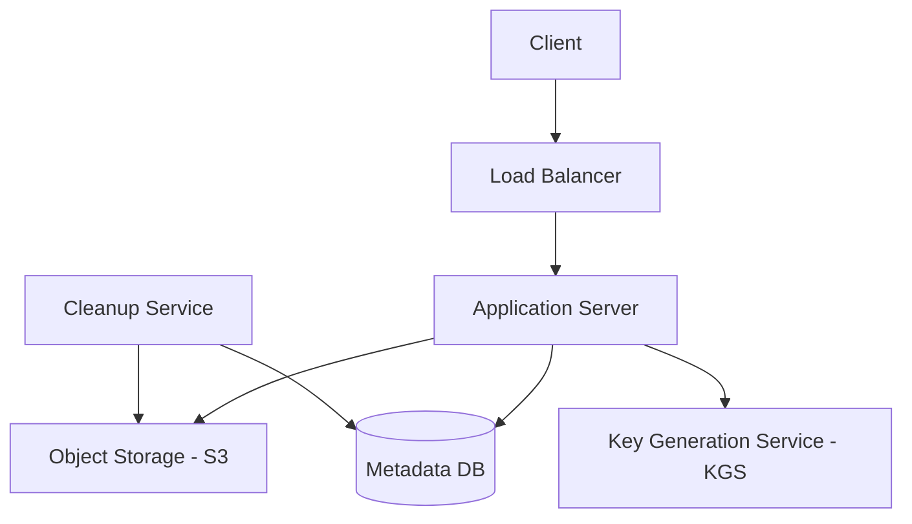

# Case Study: Pastebin

## 1. Requirements clarifications (Functional & Non-Functional)

### Functional
*   **Paste Creation:** Users can input text data and receive a unique, shortened URL to access it.
*   **Expiration:** Users can set expiration times for their pastes (e.g., 1 hour, 1 day, or never).
*   **Privacy Control:** Pastes can be set as public or private.
*   **Custom Aliases:** Support for optional custom aliases for the generated URLs.

### Non-Functional
*   **High Scalability:** Must support millions of new pastes created daily and an even larger volume of reads.
*   **High Availability:** The system must be highly available for reading existing pastes.
*   **Low Latency:** Paste creation and retrieval should be nearly instantaneous.
*   **Data Durability:** Data should be stored reliably and only removed upon expiration.

## 2. System interface definition (APIs)

*   `createPaste(api_dev_key, paste_data, custom_url=None, expiration_time=None)`: Creates a new paste and returns the unique URL.
*   `getPaste(paste_key)`: Retrieves the text content associated with the given key.
*   `deletePaste(api_dev_key, paste_key)`: Deletes the specified paste if the user has the required permissions.

## 3. Back-of-the-envelope estimation (Capacity Estimation)

*   **Write Traffic:** 1 million pastes per day $\approx$ 12 writes per second.
*   **Read Traffic:** 10 million reads per day $\approx$ 120 reads per second.
*   **Storage Requirements:** 1M pastes/day * 10KB (avg size) $\approx$ 10GB/day. This totals to $\approx$ 3.6TB per year.
*   **Bandwidth:** 12 writes/sec * 10KB $\approx$ 120KB/s for ingress; 120 reads/sec * 10KB $\approx$ 1.2MB/s for egress.

## 4. Defining data model (Database Schema/Model)

To handle scalability and keep the metadata separated from the content, we use a two-tiered storage approach.

### Schema
*   **Metadata DB (NoSQL):** `paste_key (PK), user_id, expiration_date, created_at, access_type (public/private), object_storage_path`.
    *   A NoSQL database like **Cassandra** or **MongoDB** is ideal for horizontal scaling and handling high-frequency metadata updates.
*   **Paste Content Storage:** An **Object Store** (such as Amazon S3 or a distributed file system like HDFS) stores the actual large text blobs, keeping the metadata database lean and performant.

## 5. High-level design (with Mermaid)

## 6. Detailed design (Deep dive into components)

### Key Generation Service (KGS)
To ensure every paste gets a unique, short URL (e.g., `pastebin.com/a7b2c9`) without collision:
*   **Pre-generation:** A dedicated service pre-calculates unique random strings and stores them in a "Key DB".
*   **Efficiency:** When a new paste is created, the application server fetches a key from the KGS rather than checking the main database for duplicates, which significantly reduces write latency.
*   **Management:** Apache Zookeeper can be used to manage key ranges and ensure no two application servers use the same key.

### Handling Expiration
*   **Cleanup Service:** A background process periodically scans the Metadata DB for expired entries.
*   **Deletion Path:** Once an expired paste is identified, the service removes the metadata from the database and deletes the corresponding file from the Object Store.
*   **Optimization:** Using TTL (Time-To-Live) indexes in the database can automate parts of this process.

### Caching Strategy
*   Since the system is read-heavy (10:1 read-to-write ratio), caching is critical.
*   Use **Redis** or **Memcached** to store the most frequently accessed pastes in memory.

## 7. Identifying and resolving bottlenecks (Scaling/Bottlenecks)

*   **KGS Single Point of Failure:** If the KGS becomes unavailable, new pastes cannot be created. **Resolution:** Maintain a standby KGS and allow application servers to buffer a small number of keys locally.
*   **Storage Growth:** Accumulating several terabytes per year requires a long-term strategy. **Resolution:** Implement tiered storage, moving older or less frequently accessed pastes to "cold storage" (e.g., S3 Glacier) before eventual deletion.
*   **Security and Abuse:** Public platforms are susceptible to spam and malicious content. **Resolution:** Implement robust rate limiting per API key/IP and use automated content filtering to identify and flag suspicious pastes.

## Likely Follow-Up Questions

How can we prevent users from uploading malicious content or spam?

We can implement rate limiting based on IP or user account, use automated scanning tools to detect malware or prohibited patterns, and integrate a reporting system for manual review.

How would we handle a sudden viral paste that receives millions of hits?

We use a CDN to cache popular pastes at the edge and use a distributed caching layer like Redis for the application server records to prevent database hotspots.

What is the strategy for cleaning up expired pastes?

Instead of immediate deletion, we can mark them for deletion and use a low-priority background worker to batch-delete them during off-peak hours to reduce database load.

