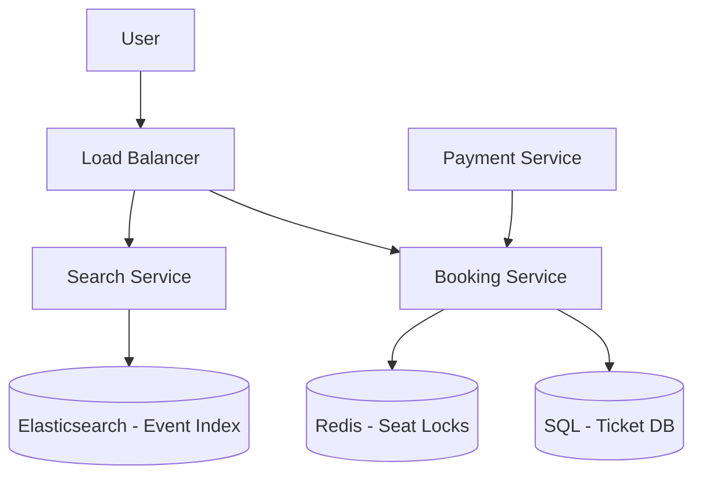

# Case Study: Ticketmaster

## 1. Requirements

### Functional
*   Users can search for events (concerts, sports).
*   Users can view a seating map and select seats.
*   Users can reserve seats for 5-10 minutes while completing payment.
*   Users can purchase tickets.

### Non-Functional
*   **High Concurrency:** Handle massive spikes when a popular concert goes on sale.
*   **Fairness:** Tickets should be sold on a first-come, first-served basis.
*   **Transaction Integrity:** No double-booking of the same seat.
*   **Latency:** Real-time updates on seat availability.

## 2. Capacity Estimation
*   **Traffic:** 10M page views for a popular event in minutes.
*   **Booking Rate:** 5,000 tickets per second.
*   **Storage:** Millions of events, each with thousands of seats.

## 3. APIs
*   `searchEvents(query, location, date)`
*   `getSeatingMap(event_id)`
*   `reserveSeats(event_id, seat_ids, user_id)`
*   `confirmPayment(reservation_id, payment_info)`

## 4. DB Design
*   **Event Table:** `event_id, name, venue_id, start_time`.
*   **Seat Table:** `seat_id, event_id, row, number, status (Available, Reserved, Sold)`.
*   **Reservation Table:** `res_id, user_id, seat_id, expiry_time, status`.
*   **Relational DB (SQL):** Essential for ACID transactions to prevent double-booking.

## 5. HLD with Mermaid

## 6. Detailed Design

### Handling High Traffic Spikes
*   **Virtual Waiting Room:** A queueing system (e.g., using a Token Bucket or specialized service) that allows users into the booking flow at a controlled rate.
*   **CDN:** Cache event details and seating maps at the edge to reduce load on origin servers.

### Seat Reservation (The Locking Mechanism)
1.  User selects a seat.
2.  Booking Service attempts to set a lock in Redis with a TTL (Time-To-Live) of 10 mins: `SET seat_123 user_456 EX 600 NX`.
3.  If successful, the status in the SQL DB is updated to 'Reserved' within a transaction.
4.  If the user doesn't pay, the Redis lock expires and a background worker marks the seat as 'Available' in the DB.

### Database Sharding
Shard the database by `event_id`. All seats for a single event will be on the same shard, making transaction management easier.

## 7. Bottlenecks
*   **Database Contention:** Thousands of users trying to book the same 'front row' seats simultaneously. Solution: Use row-level locking or optimistic concurrency control.
*   **Payment Failure:** If the payment gateway is slow, it ties up reservations. Use asynchronous payment processing with webhooks.
*   **Scalability of the Waiting Room:** The queue itself must be highly available and distributed.
