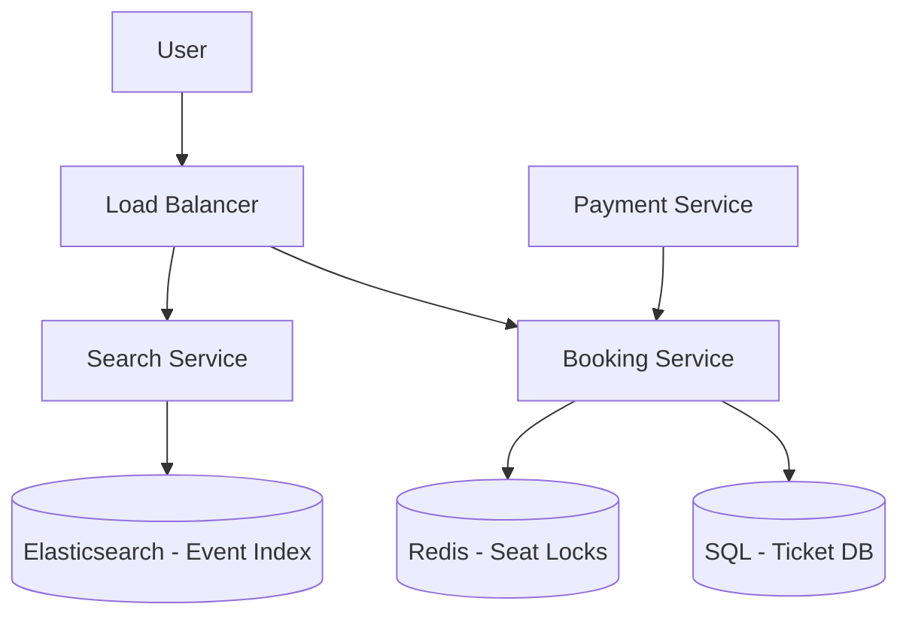

# Case Study: Ticketmaster

## 1. Requirements clarifications (Functional & Non-Functional)

### Functional
*   Users can search for events (concerts, sports) by name, location, or date.
*   Users can view a real-time seating map and select specific seats.
*   Users can reserve seats for a limited time (5-10 minutes) while completing payment.
*   Users can securely purchase tickets and receive confirmation.

### Non-Functional
*   **High Concurrency:** Must handle massive traffic spikes when popular events go on sale.
*   **Fairness:** Tickets should be allocated on a first-come, first-served basis.
*   **Transaction Integrity:** Strict ACID properties to prevent double-booking of the same seat.
*   **Low Latency:** Real-time updates on seat availability to provide a seamless user experience.

## 2. System interface definition (APIs)

*   `searchEvents(query, location, date)`: Returns a list of events matching the search criteria.
*   `getSeatingMap(event_id)`: Retrieves the layout and current status of all seats for a specific event.
*   `reserveSeats(event_id, seat_ids, user_id)`: Places a temporary lock on selected seats for the user.
*   `confirmPayment(reservation_id, payment_info)`: Finalizes the purchase and converts reservations into confirmed tickets.

## 3. Back-of-the-envelope estimation (Capacity Estimation)

*   **Traffic:** Anticipate 10M+ page views within minutes for high-demand event launches.
*   **Booking Rate:** Must support at least 5,000 ticket transactions per second.
*   **Storage:** Millions of events, each potentially having thousands of seats, requiring efficient indexing and storage.

## 4. Defining data model (Database Schema/Model)

*   **Event Table:** `event_id (PK), name, venue_id, start_time, description`.
*   **Seat Table:** `seat_id (PK), event_id (FK), row, number, status (Available, Reserved, Sold)`.
*   **Reservation Table:** `res_id (PK), user_id (FK), seat_id (FK), expiry_time, status`.
*   **Storage Choice:** A **Relational Database (SQL)** is essential to leverage ACID transactions, ensuring that seat status updates are atomic and consistent.

## 5. High-level design (with Mermaid)

## 6. Detailed design (Deep dive into components)

### Handling High Traffic Spikes
*   **Virtual Waiting Room:** Implement a queueing system (e.g., using a Token Bucket algorithm) to throttle incoming requests and allow users into the booking flow at a sustainable rate.
*   **CDN Integration:** Cache static event details, images, and seating map templates at the edge to significantly reduce load on origin servers.

### Seat Reservation (The Locking Mechanism)
1.  **Selection:** When a user selects a seat, the Booking Service attempts to acquire a distributed lock.
2.  **Distributed Lock:** Use Redis with a TTL (Time-To-Live) of 10 minutes: `SET seat_123 user_456 EX 600 NX`.
3.  **Database Update:** Upon successful locking in Redis, the status in the SQL database is updated to 'Reserved' within a transaction.
4.  **Cleanup:** If the user fails to complete the payment before the TTL, the Redis lock expires, and a background worker reverts the seat status to 'Available' in the database.

### Database Sharding
*   Shard the database by `event_id`. This ensures all seat data for a specific event resides on the same shard, simplifying transaction management and improving performance for localized event queries.

## 7. Identifying and resolving bottlenecks (Scaling/Bottlenecks)

*   **Database Contention:** Thousands of users may compete for the same 'front row' seats simultaneously. **Resolution:** Use row-level locking or optimistic concurrency control to manage simultaneous updates.
*   **Payment Processing Latency:** Slow payment gateways can stall reservations. **Resolution:** Implement asynchronous payment processing with webhooks for status updates.
*   **Waiting Room Scalability:** The virtual waiting room itself must be highly available and distributed to avoid becoming a single point of failure. **Resolution:** Use a distributed messaging queue like Kafka or a managed global load balancer.

## Likely Follow-Up Questions

??? "How do we handle a massive surge in traffic during a popular artist's tour sale?"

    We use a virtual waiting room (queue) to throttle the number of users entering the checkout flow, combined with aggressive CDN caching for the event browsing pages.

??? "How do we prevent double-booking of the same seat?"

    We use distributed locking (e.g., Redis Lock or database row-level locking) with a short TTL. When a user selects a seat, it is "held" for ~10 minutes while they complete the payment.

??? "How do we mitigate bot attacks buying up all the tickets?"

    We implement CAPTCHA, rate limiting per IP/Account, and behavioral analysis to detect automated scraping and purchasing.

??? "What happens if the payment goes through but the session expires?"

    The system should perform a reconciliation process. If the payment is confirmed but the lock was released, it either attempts to finalize the reservation if the seat is still available or issues an automatic refund.
