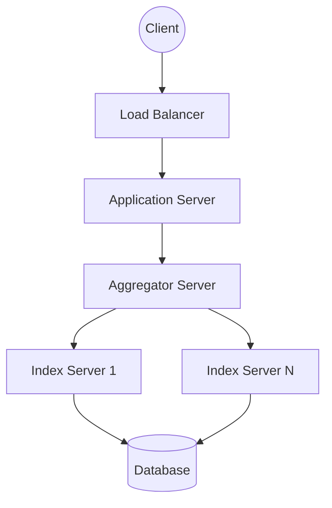

# Twitter Search Design

## 1. Requirements Clarifications

**Functional Requirements:**

- Twitter users can update their status whenever they like. Each status (called tweet) consists of plain text.
- Our goal is to design a system that allows searching over all the user tweets.
- The search query will consist of multiple words combined with AND/OR.

**Non-Functional Requirements:**

- The system needs to be highly available.
- Search should return results in real-time (minimal latency).
- Scalability is paramount, given the massive read and write volume.

## 2. Capacity Estimation and Constraints

Let’s assume Twitter has 1.5 billion total users with 800 million daily active users. On average Twitter gets 400 million tweets every day.
The average size of a tweet is 300 bytes. Let’s assume there will be 500M searches every day.

- **Storage Capacity:** Since we have 400 million new tweets every day and each tweet on average is 300 bytes, the total storage we need will be 120GB/day (`400M * 300 => 120GB/day`). Total storage per second is `120GB / 24hours / 3600sec ~= 1.38MB/second`.

## 3. System APIs

We can have SOAP or REST APIs to expose functionality of our service:

`search(api_dev_key, search_terms, maximum_results_to_return, sort, page_token)`

**Parameters:**

- `api_dev_key` (string): The API developer key of a registered account.
- `search_terms` (string): A string containing the search terms.
- `maximum_results_to_return` (number): Number of tweets to return.
- `sort` (number): Optional sort mode: Latest first (0 - default), Best matched (1), Most liked (2).
- `page_token` (string): This token will specify a page in the result set that should be returned.

**Returns:** (JSON)
A JSON containing information about a list of tweets matching the search query.

## 4. Database Design

We need to store all the statues in a database and also build an index that can keep track of which word appears in which tweet.

**1. Storage:** We need to store 120GB of new data every day. Over 5 years, we need around 200TB (`120GB * 365days * 5years ~= 200TB`). We can store the tweets in a MySQL database having two columns: `TweetID` and `TweetText`. 

**2. Index:** Since our tweet queries will consist of words, let’s build the index that can tell us which word comes in which tweet object. Let’s estimate how big our index will be. If we want to build an index for all the English words and some famous nouns, let's assume we have 500k total words in our index. Our index would be like a big distributed hash table, where `key` would be the word and `value` will be a list of `TweetID`s of all those tweets which contain that word.

## 5. High Level Design

At a high level, we need a Load Balancer distributing requests to application servers, which query Aggregator Servers. Aggregator Servers query Index Servers, which build an index over the Data Storage.

## 6. Detailed Component Design

**Data Partitioning:**
Since we have a huge amount of data, we need to partition it.

- *Sharding based on Words:* We can store our phrases in separate partitions based on their first letter. If a word becomes hot, that server will have high load.
- *Sharding based on the tweet object:* While storing, we will pass the `TweetID` to our hash function to find the server and index all the words of the tweet on that server. While querying for a particular word, we have to query all the servers, and each server will return a set of `TweetID`s. A centralized server (Aggregator) will aggregate these results to return them to the user.

**Ranking:**
If we want to rank tweets by popularity (likes or comments), our ranking algorithm can calculate a ‘popularity number’ and store it with the index. Each partition can sort the results based on this popularity number before returning results to the aggregator server.

## 7. Identifying and Resolving Bottlenecks

**Fault Tolerance:**
What will happen when an index server dies? We can have a secondary replica of each server. If both die, we have to rebuild the index. We can efficiently retrieve a mapping between tweets and the index server by building a reverse index that will map all the `TweetID`s to their index server (Index-Builder server). 

**Cache:**
To deal with hot tweets we can introduce a cache in front of our database. We can use Memcached, which can store all such hot tweets in memory. Least Recently Used (LRU) seems suitable for our system cache eviction policy.

**Load Balancing:**
We can add a load balancing layer at two places in our system:
1) Between Clients and Application servers.
2) Between Application servers and Backend servers.
Using a Round Robin or intelligent load-based approach will help balance the traffic.

## Likely Follow-Up Questions

??? "How do we handle the "thundering herd" problem when a major event occurs?"

    We scale our ingestion workers and use message queues (like Kafka) to buffer the surge in tweets, ensuring our indexing pipeline doesn't crash under pressure.

??? "How do we prioritize search results for trending topics?"

    We use a ranking algorithm that factors in tweet recency, engagement metrics (likes, retweets), and user authority, combined with a real-time "trending" service.

??? "How do we efficiently search across billions of historical tweets?"

    We use a tiered storage approach where recent tweets are in memory/SSD for fast access, and older tweets are stored in a distributed inverted index across a large cluster (e.g., Lucene-based).
