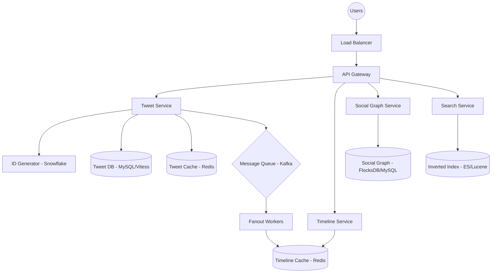

# Twitter Design

## Problem Statement

Design a social media platform that allows users to:
- Post short text-based messages (Tweets)
- Follow other users
- View a timeline of tweets from followed users
- Search for tweets and hashtags
- View trending topics

## Key Challenges

1. **Fan-out on Write**: Delivering a single tweet to millions of followers' timelines in real-time.
2. **High Read Volume**: 100x more reads than writes; timeline generation must be extremely fast.
3. **Availability vs. Consistency**: Prioritizing availability for timeline delivery (Eventually Consistent).
4. **Distributed ID Generation**: Generating unique, time-sorted IDs for billions of tweets.

## Architecture Overview

## Data Model

**Users Table (MySQL)**
- user_id (PK), username, email, created_at, profile_metadata

**Tweets Table (MySQL)**
- tweet_id (PK), user_id (FK), text, created_at, reply_to, retweets_count

**Follows Table (MySQL)**
- follower_id, followee_id, created_at (Composite PK)

**User Timeline (Redis)**
- List of `tweet_id`s for each user, capped at ~1000 items.

## Key Decisions

- **ID Generation (Snowflake)**: Uses a 64-bit ID comprising a timestamp, worker ID, and sequence number. This ensures IDs are unique, roughly time-sorted, and can be generated in a distributed manner without a central bottleneck.
- **Timeline Generation**:
  - **Regular Users (Push/Fan-out on Write)**: When a user tweets, it is pushed to the Redis timelines of all followers.
  - **Celebrities (Pull/Fan-out on Read)**: Tweets from users with millions of followers are not pushed. Instead, followers' timelines fetch these tweets at read-time and merge them with their pre-computed Redis timeline.
- **Storage Strategy**:
  - **MySQL with Vitess**: Used for structured data like users and tweets, providing horizontal scaling through sharding.
  - **Redis Clusters**: Essential for serving timelines with sub-millisecond latency.
- **Search**: Uses an inverted index to support keyword and hashtag searches, updated asynchronously via Kafka.
