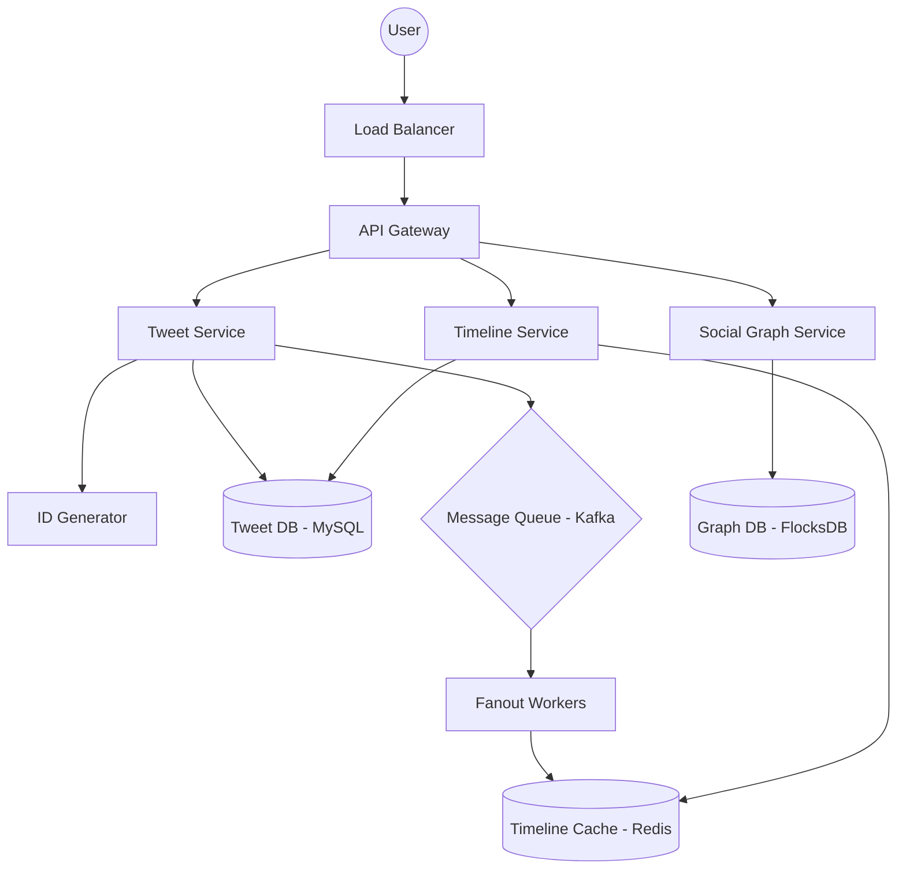

# Twitter System Design

## 1. Requirements clarifications (Functional & Non-Functional)

### Functional Requirements
- **Post Tweets:** Users can post new tweets (text up to 280 chars, images, videos).
- **Timeline:**
    - **Home Timeline:** View a feed of tweets from all people the user follows.
    - **User Timeline:** View a feed of tweets posted by a specific user.
- **Following:** Users can follow/unfollow other users.
- **Search:** Search tweets by keywords or hashtags.

### Non-Functional Requirements
- **High Availability:** The system must be highly available (Prioritize availability over consistency).
- **Low Latency:** Home timeline generation should be < 200ms.
- **Scalability:** System should handle 500M+ tweets per day and 300M DAU.
- **Eventual Consistency:** It's okay if a tweet takes a few seconds to appear in all followers' timelines.

---

## 2. System interface definition (APIs)

### Tweet Service
- `postTweet(user_id, tweet_text, media_ids[])` -> Returns `tweet_id`.
- `deleteTweet(user_id, tweet_id)` -> Returns Success/Failure.

### Timeline Service
- `getHomeTimeline(user_id, count, last_tweet_id)` -> Returns list of Tweet objects.
- `getUserTimeline(user_id, count, last_tweet_id)` -> Returns list of Tweet objects.

### Social Graph Service
- `follow(follower_id, followee_id)`
- `unfollow(follower_id, followee_id)`

---

## 3. Back-of-the-envelope estimation (Capacity Estimation)

### Traffic Estimates
- **DAU (Daily Active Users):** 300 Million.
- **Tweets per day:** Assume 500 Million.
- **Read/Write Ratio:** Twitter is read-heavy. Assume 100:1 (100 reads for every 1 write).
- **Read Queries:** 500M * 100 = 50 Billion reads/day.
- **QPS (Writes):** 500M / 86400s ≈ 6,000 tweets/sec.
- **QPS (Reads):** 50B / 86400s ≈ 600,000 queries/sec.

### Storage Estimates
- **Avg Tweet Size:** 280 bytes (text) + 200 bytes (metadata) ≈ 500 bytes.
- **Daily Storage:** 500M * 500 bytes = 250 GB/day.
- **5-Year Storage:** 250 GB * 365 * 5 ≈ 450 TB.
- **Media Storage:** If 20% of tweets have images (avg 200KB) and 5% have videos (avg 2MB):
    - Images: 100M * 200KB = 20 TB/day.
    - Videos: 25M * 2MB = 50 TB/day.
    - Total Media: ~70 TB/day.

---

## 4. Defining data model (Database Schema/Model)

We use a combination of SQL for structured metadata and NoSQL/Key-Value stores for timelines.

### Users Table (SQL - MySQL/Vitess)
| Column | Type | Description |
| :--- | :--- | :--- |
| `user_id` | BIGINT (PK) | Unique User ID |
| `username` | VARCHAR(32) | Unique Handle |
| `email` | VARCHAR(255) | User Email |
| `created_at` | TIMESTAMP | Account Creation Time |

### Tweets Table (SQL - MySQL/Vitess)
| Column | Type | Description |
| :--- | :--- | :--- |
| `tweet_id` | BIGINT (PK) | Unique Tweet ID (Snowflake) |
| `user_id` | BIGINT (FK) | ID of the creator |
| `content` | VARCHAR(280) | Tweet text |
| `lat`, `long` | DOUBLE | Location (Optional) |
| `created_at` | TIMESTAMP | Creation time |

### Follows Table (SQL)
| Column | Type | Description |
| :--- | :--- | :--- |
| `follower_id` | BIGINT | Person who follows |
| `followee_id` | BIGINT | Person being followed |
| `created_at` | TIMESTAMP | When following started |

*Indexing: Composite Index on (follower_id, created_at) for fast retrieval of followees.*

---

## 5. High-level design (with Mermaid)

---

## 6. Detailed design (Deep dive into components)

### Timeline Fan-out (Core Mechanism)
The process of delivering tweets to followers is called "Fan-out".
1. **Push Model (Fan-out on Write):**
   - When a user tweets, we push the tweet ID to all followers' pre-computed timelines in Redis.
   - **Pros:** Fast reads (O(1) to fetch timeline).
   - **Cons:** Slow writes for "Celebrities" (e.g., millions of followers).
2. **Pull Model (Fan-out on Read):**
   - Timelines are generated only when the user requests them.
   - **Pros:** Efficient for celebrities.
   - **Cons:** Slow reads for everyone else (O(N) where N is number of followees).
3. **Hybrid Model (Optimized):**
   - **Regular Users:** Use the Push Model.
   - **Celebrities (> 100k followers):** Use the Pull Model. Their tweets are merged into the follower's timeline at read-time.

### ID Generation (Snowflake)
To ensure tweets are unique and roughly time-sorted across distributed machines:
- 64-bit ID: `1 bit (unused) | 41 bits (timestamp) | 10 bits (machine ID) | 12 bits (sequence number)`.

---

## 7. Identifying and resolving bottlenecks (Scaling/Bottlenecks)

### Sharding
- **Tweets DB:** Shard by `user_id` to keep all tweets of a user on one shard (fast User Timeline). However, this can cause "hot shards" for celebrities.
- **Alternative:** Shard by `tweet_id` (Snowflake IDs) for uniform distribution, using a separate mapping/indexing service for user-to-tweet lookups.

### Caching
- **Redis Clusters:** Store the last 1000 tweet IDs for every active user's home timeline.
- **CDN:** Cache media files (images/videos) at the edge.

### Monitoring & Load Balancing
- **Load Balancers:** Use Layer 7 LBs (Application level) to route traffic based on URL.
- **Rate Limiting:** Protect APIs from scraping and DDoS.

## Interviewer Lens

Twitter is a feed system, so the real interview signal is how well you balance write fan-out, read latency, and celebrity outliers. The strongest answer explains why the hybrid push/pull approach exists, how the social graph is stored, and how the feed cache is refreshed without overwhelming the system.

## Likely Follow-Up Questions

- How do you handle a user with tens of millions of followers?
- What happens if the timeline cache is stale or partially missing?
- How would you rank tweets beyond simple recency?
- How would you shard tweets and follow relationships separately?
- What changes if search becomes a first-class feature instead of an add-on?
