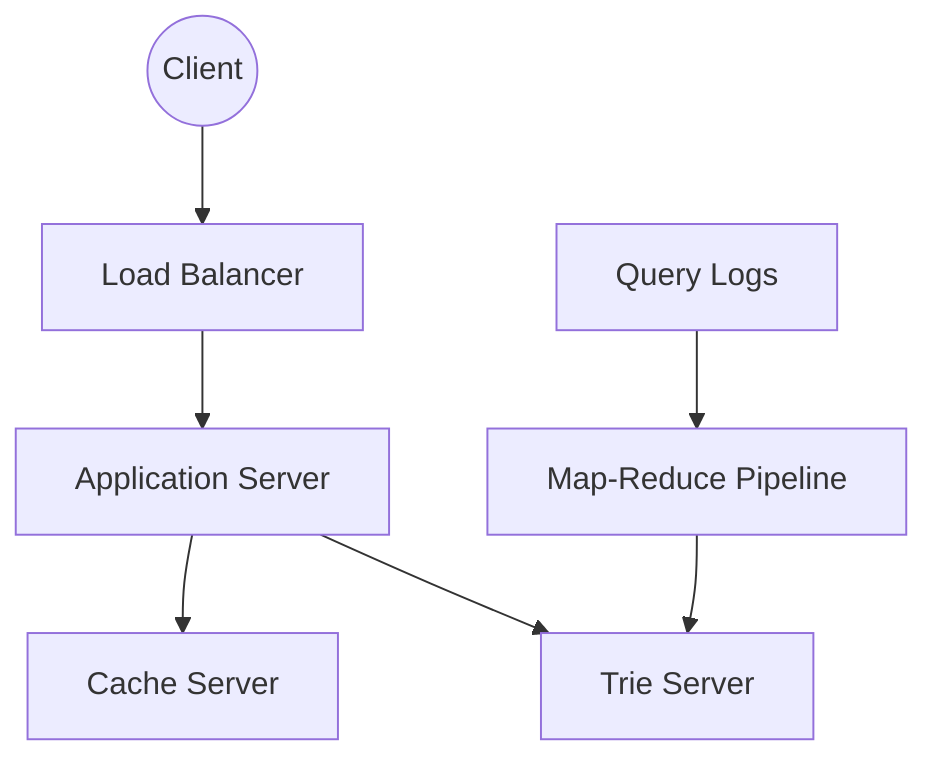

# Typeahead Suggestion Design

## 1. Requirements Clarifications

**Functional Requirements:**
- As the user types in their query, our service should suggest top 10 terms starting with whatever the user has typed.

**Non-Functional Requirements:**
- The suggestions should appear in real-time. The user should be able to see the suggestions within 200ms.
- High availability and scalability.

## 2. Capacity Estimation and Constraints

Let's assume 5 billion searches every day, which would give us approximately 60K queries per second. 
Assume that only 20% of these will be unique. Let’s assume we will have 100 million unique terms for which we want to build an index.

- **Storage Estimation:** If on average each query consists of 3 words and average length of a word is 5 characters (15 characters of average query size), requiring 2 bytes per character, we need 30 bytes per query. Total storage = `100 million * 30 bytes => 3 GB`. This data can easily fit in a single server's memory, but partitioning will be needed for fault tolerance and to reduce latency.

## 3. System APIs

`suggest(api_dev_key, prefix, maximum_results_to_return)`

**Parameters:**
- `api_dev_key` (string): The API developer key.
- `prefix` (string): The characters entered by the user.
- `maximum_results_to_return` (number): Number of suggestions to return (e.g., 10).

**Returns:** (JSON)
A list of strings containing top suggestions.

## 4. Database Design (Index)

Since we need to serve a lot of queries with minimum latency, we cannot depend upon a relational database for realtime lookups. We need to store our index in memory in a highly efficient data structure. 
One of the most appropriate data structures is the **Trie**.

A trie is a tree-like data structure used to store phrases where each node stores a character of the phrase in a sequential manner.

## 5. High Level Design

Our system will consist of a Load Balancer, Application Servers, and Trie Servers holding the distributed index. An offline Map-Reduce pipeline will compute query frequencies and build/update the Trie.

## 6. Detailed Component Design

**Building and Updating the Trie:**
To find top suggestions, we can store the count of searches that terminated at each node. To optimize, we can store the top 10 suggestions with each node. This requires extra storage but significantly reduces traversal time.
Updating the trie for every query is extremely resource-intensive. One solution is to update our trie offline after a certain interval using a Map-Reduce (MR) setup to process all the logging data periodically (e.g., every hour).

**Data Partitioning:**
- *Range Based Partitioning:* Store phrases in separate partitions based on their first letter (e.g., A-E in one server, F-J in another). This can lead to unbalanced servers.
- *Partition based on the maximum capacity:* Partition the trie based on the maximum memory capacity of the servers.
- *Partition based on the hash of the term:* Each term will be passed to a hash function, which will generate a server number and store the term there. We must ask all servers and then aggregate the results.

## 7. Identifying and Resolving Bottlenecks

**Caching:**
Caching the top searched terms will be extremely helpful. We can have separate cache servers in front of the trie servers holding most frequently searched terms and their typeahead suggestions.

**Fault Tolerance:**
We should have replicas for our trie servers. We can use a master-slave configuration; if the master dies, the slave can take over.

**Typeahead Client Optimizations:**
1. The client should only try hitting the server if the user has not pressed any key for 50ms.
2. If the user is constantly typing, the client can cancel the in-progress requests.
3. Clients can pre-fetch some data from the server.
4. Establish an early connection with the server (e.g. WebSockets) to reduce connection overhead.

## Likely Follow-Up Questions

How do we handle trending or "breaking news" terms that aren't in the Trie yet?

We can have a fast-path ingestion pipeline that process recent search logs every few minutes to update a small "trending" Trie or a cache that takes precedence over the main Trie.

How do we limit the memory usage of the Trie?

We can prune the Trie by removing nodes that haven't been searched for in a long time, or by only storing the top $K$ suggestions at each node instead of all possible continuations.

How do we handle typos or fuzzy matching in suggestions?

Instead of a simple Trie, we can use an Edit Distance algorithm like Levenshtein distance or a fuzzy search index (e.g., using n-grams) to find terms that are "close" to the user's input.

How do we personalize suggestions based on user history?

We can maintain a small user-specific Trie or weighted list in a low-latency cache like Redis. When a user starts typing, we merge these personal results with the global ones.

