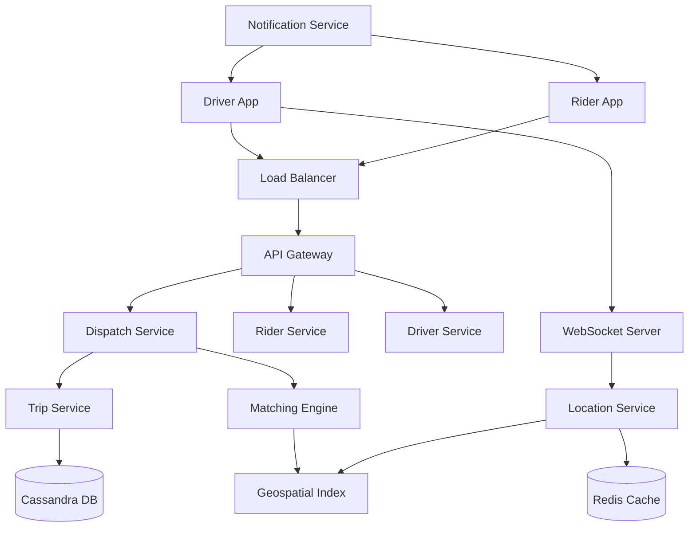

# Uber System Design Case Study

This case study provides a comprehensive overview of the system architecture for a ride-hailing service like Uber. It follows a structured approach to address the complexities of real-time geospatial tracking, high-scale matching, and system resilience.

## 1. Requirements Clarifications

### Functional Requirements
*   **Rider:**
    *   View nearby drivers in real-time.
    *   Request a ride with source and destination.
    *   Track the driver's location and receive ETAs.
    *   Rate and tip the driver after the trip completes.
*   **Driver:**
    *   Update location every few seconds.
    *   Accept or reject ride requests.
    *   Navigate to the rider and then to the destination.
*   **System:**
    *   Efficiently match riders with the most suitable drivers.
    *   Handle payments and billing.

### Non-Functional Requirements
*   **High Availability:** The system must be available 24/7; a failure in one region should not impact others.
*   **Low Latency:** Matching should happen in under 1 second. Location updates must be reflected quickly.
*   **Scalability:** Support millions of concurrent riders and drivers.
*   **High Reliability:** Trip data and financial transactions must be durable and consistent.

---

## 2. Capacity Estimation and Constraints

### Traffic Assumptions
*   **Total Users:** 500 million.
*   **Active Drivers:** 5 million.
*   **Daily Active Users (DAU):** 50 million.
*   **Daily Trips:** 20 million.
*   **Peak Trips per second:** ~2,000 requests/sec.

### Storage & Bandwidth
*   **Location Updates:** 5M drivers updating every 4 seconds = 1.25M updates/sec.
*   **Data Size per update:** (DriverID + Lat + Long) ≈ 32 bytes.
*   **Total Bandwidth (Location):** 1.25M * 32 bytes ≈ 40 MB/sec.
*   **Trip History:** 20M trips/day. Each trip record ≈ 1KB. 20GB/day. 5 years ≈ 36.5 TB.

---

## 3. System APIs

### Rider APIs
*   `POST /v1/ride/request`: Initiates a ride request.
    *   *Parameters:* `rider_id`, `source_lat`, `source_long`, `dest_lat`, `dest_long`, `payment_method`.
*   `GET /v1/ride/{trip_id}`: Polls for ride status and driver location.

### Driver APIs
*   `PUT /v1/driver/location`: Streams current GPS coordinates.
    *   *Payload:* `driver_id`, `lat`, `long`, `status (Available/Busy)`.
*   `PATCH /v1/ride/{trip_id}/accept`: Driver accepts a specific ride request.

---

## 4. Database Design

### Data Stores
1.  **Relational DB (PostgreSQL):** For ACID-compliant data like User Profiles, Driver Info, and Billing.
2.  **NoSQL DB (Cassandra):** For high-write throughput of Trip History and Logs.
3.  **In-Memory Store (Redis):** For real-time driver locations (high velocity, ephemeral data).

### Schema (Relational)
*   **Users Table:** `user_id (UUID)`, `name`, `email`, `rating`.
*   **Drivers Table:** `driver_id (UUID)`, `car_details`, `rating`, `is_active (Bool)`.
*   **Trips Table:** `trip_id (UUID)`, `rider_id`, `driver_id`, `source_geo`, `dest_geo`, `fare`, `status`, `timestamp`.

---

## 5. High Level Design

---

## 6. Detailed Component Design

### Geospatial Indexing: QuadTrees vs. Google S2
To find drivers near a rider, we cannot perform a standard SQL `SELECT * WHERE dist < 5km` as it would require a full table scan.
*   **QuadTrees:** Divides the map into four quadrants recursively until a node contains a limited number of drivers. However, QuadTrees are difficult to re-balance dynamically when drivers move.
*   **Google S2 / H3:** Projects the Earth onto a cube and uses Hilbert Curves to map 2D coordinates to a 1D index (Cell ID). This allows "proximity" to be calculated via simple bitwise operations, making it extremely efficient for distributed systems.

### Matching Algorithm
When a request arrives, the **Matching Engine** queries the **Geo-Index** for available drivers in the same or neighboring S2 cells. It doesn't just pick the closest; it filters by:
1.  Driver's current heading (towards the rider).
2.  Historical ETA accuracy.
3.  Batching: Waiting a few seconds to optimize multiple requests simultaneously for global efficiency.

---

## 7. Identifying and Resolving Bottlenecks

### Sharding and Partitioning
*   **Geographic Sharding:** Data is partitioned by City or Region. A failure in the "London" shard won't affect users in "San Francisco".
*   **Consistent Hashing:** Used in the Location Service to ensure that location updates for a specific `driver_id` always land on the same server, preventing race conditions.

### Caching Strategy
*   **Location Cache:** Redis stores the latest coordinates of all active drivers with a short TTL.
*   **Metadata Caching:** User and Driver profiles are cached in Memcached to reduce DB load.

### Reliability
*   **Idempotency:** All APIs (especially payments) use idempotency keys to prevent duplicate transactions during retries.
*   **Circuit Breakers:** Used when communicating with external Payment Gateways to prevent cascading failures.

## Interviewer Lens

Uber is mainly about real-time geospatial matching under tight latency and correctness requirements. The interesting part is not just storing locations, but continuously refreshing them, matching nearby drivers, and keeping the trip state consistent across retries, failures, and payment handoffs.

## Likely Follow-Up Questions

<strong>How would you partition drivers and riders by region or city?</strong>

Geographic partitioning improves locality and reduces cross-region latency:

- **Shard by region (e.g., US East, US West, EU)**: Each region has its own matching and database cluster.
- **Shard by city**: More granular, but increases operational complexity.
- **Consistent hashing for grid cells**: Partition by geohash or S2 cell ID; nearby requests hash to same shard.
- **Hot shard handling**: Major cities (NYC, LA) may split into multiple shards; track hot cells and split dynamically.
- **Cross-region matching**: If riders and drivers are in different regions, use inter-region messaging queue.

Trade-off: More shards reduce latency but add operational complexity and rebalancing overhead.

<strong>How do you handle driver location updates arriving out of order?</strong>

Location updates from GPS can arrive delayed, and network issues cause reordering:

- **Timestamp-based acceptance**: Only update if new location's timestamp > current timestamp.
- **Version vector**: Track version of each driver's location; ignore older versions.
- **Duplicate detection**: Use idempotent keys (e.g., (driver_id, update_timestamp)) to deduplicate retries.
- **Buffer and sort**: Buffer updates for 100-200ms, sort by timestamp, then process in order.
- **Kalman filtering**: Apply smoothing to noisy GPS data; detect outliers.

Implementation: Use write-through cache with conditional updates; only update if new timestamp is fresher.

<strong>What happens if matching fails after a rider request is created?</strong>

Matching can fail for many reasons: no drivers available, all drivers decline, network issues, etc.

- **Timeout**: After 30-60 seconds with no match, notify rider "no drivers available" and cancel.
- **Fallback**: Widen search radius (increase from 500m to 1km) and re-attempt.
- **Queue with backoff**: Put request in queue; retry matching every 5 seconds up to 5 times.
- **Manual escalation**: If still no match, escalate to support team.
- **Graceful degradation**: Show rider estimated wait time; allow cancellation at any point.
- **Retry idempotency**: Track request_id; avoid duplicate matching attempts.

Monitoring: Alert if match failure rate > 5%; indicates driver shortage or system issue.

<strong>How do you avoid double-charging during payment retries?</strong>

Payment retries are a major source of bugs and fraud risk:

- **Idempotent payment key**: Use (trip_id, payment_attempt_id) as idempotency key; payment processor deduplicates.
- **State machine**: Track payment state: pending → charged → completed. Only charge in pending state.
- **Strict idempotency**: If retry receives duplicate request, return cached response (success) without re-charging.
- **Reconciliation**: End-of-day reconciliation: sum all charges and compare to completed trips. Flag mismatches.
- **Soft holds**: Use card soft holds (temporary reservations) instead of charges; settle at trip end.
- **Refund policy**: If double-charged, auto-refund detected duplicates within 24 hours.

Implementation: Store payment idempotency key in database; payment service checks key before charging.

<strong>How would surge pricing or ETA recalculation fit into the design?</strong>

Surge pricing and ETA are complex features that interact with matching and pricing:

- **Surge pricing**: Calculate supply/demand ratio per city. Multiply base fare by surge_multiplier (e.g., 1.5x, 2x).
- **Real-time calculation**: Update surge_multiplier every 1-5 minutes based on active driver/rider counts.
- **ETA calculation**: Use Google Maps API or pre-computed road networks to estimate travel time.
- **ETA freshness**: Cache ETA for 30-60 seconds; recalculate on demand if stale.
- **Locking**: Lock surge price at request creation; charge that price even if surge changes later.
- **Fairness**: Surge pricing should increase during high-demand periods (evening rush), not random events.

Architecture: Add surge pricing microservice; call before matching to notify rider of surge price.

## Trade-Offs To Call Out

- Strong consistency is more important for trip state and payments than for live map freshness.
- Geospatial partitioning improves lookup speed, but it can create regional hotspots that need balancing.
- Consistent hashing helps distribute location updates, but the geo layer still needs locality-aware routing.
- Push-based location updates give low latency, but stale drivers must expire quickly to avoid bad matches.
- Idempotency keys are essential because retries are normal in real-time mobile systems.
