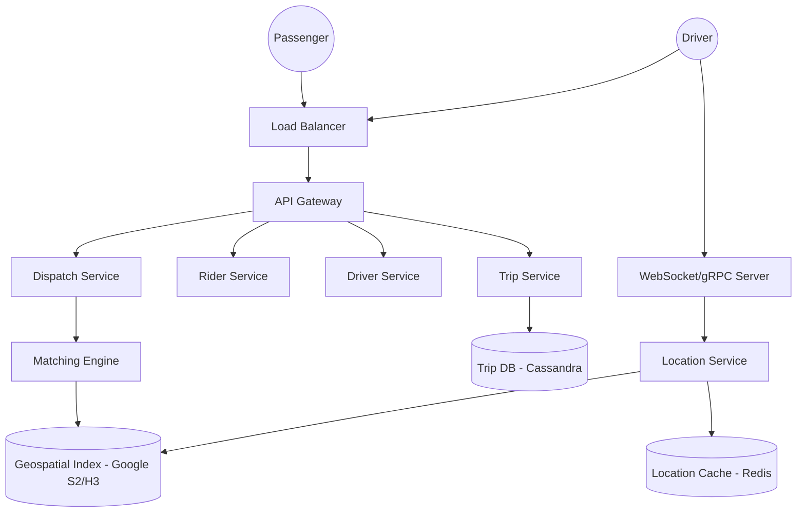

# Uber Design

## Problem Statement

Design a ride-hailing service that:
- Allows passengers to request rides
- Matches passengers with nearby drivers in real-time
- Tracks driver locations and provides ETAs
- Handles payments and ratings

## Key Challenges

1. **Real-time Geospatial Updates**: Drivers send location updates every few seconds; the system must process millions of updates per second.
2. **Efficient Matching**: Quickly finding the "best" driver (not just the closest) in a high-density area.
3. **Availability and Partitioning**: Handling city-level failures and ensuring low latency globally.
4. **ETA Calculation**: Predicting travel time based on traffic, road construction, and weather.

## Architecture Overview

## Data Model

**Rider/Driver Tables (PostgreSQL)**
- id, name, rating, status (Active/Busy), vehicle_details

**Trips Table (Cassandra)**
- trip_id, rider_id, driver_id, source, destination, status, fare, created_at

**Location Store (Redis)**
- driver_id -> {lat, long, last_updated} (TTL for stale data)

## Key Decisions

- **Geospatial Indexing (Google S2/H3)**: Instead of traditional Quadtrees, Uber uses libraries like **S2** or **H3** to divide the world into cells. This allows for extremely fast neighbor queries (finding drivers in nearby cells) using simple bitwise operations.
- **Communication Protocol**: Uses **WebSockets** or **gRPC** for persistent connections between the mobile apps and the server. This reduces the overhead of HTTP handshakes for frequent location updates.
- **Microservices by City**: To ensure high availability and low latency, Uber often shards its dispatch and matching logic by city or region. A failure in London should not affect rides in San Francisco.
- **Matching Engine**: The algorithm considers more than just distance. It looks at the driver's current heading, historical ETA accuracy, and "batch matching" (matching multiple riders and drivers at once to optimize global efficiency).
- **Consistent Hashing**: Used to distribute location updates across a cluster of servers, ensuring that updates for a specific driver always go to the same server for processing.
