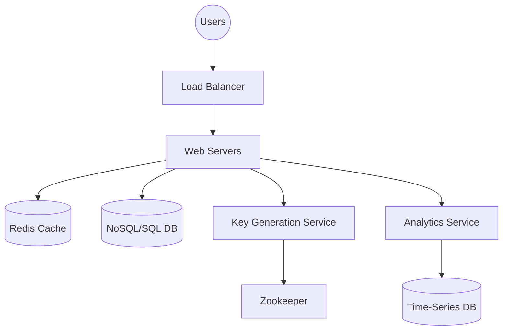

# URL Shortener Design

## Problem Statement

Design a service like Bitly that:
- Generates a unique short alias for a given long URL
- Redirects users to the original long URL when they access the short alias
- Supports custom aliases
- Tracks analytics (click counts, etc.)
- Allows URL expiration

## Key Challenges

1. **Read-Heavy Workload**: Far more redirects (reads) than shortening requests (writes).
2. **Low Latency**: Redirection must be near-instant.
3. **Uniqueness**: Short aliases must be unique and collision-free.
4. **Availability**: If the service is down, all shortened links break.

## Architecture Overview

## Data Model

**URL Mapping (NoSQL - Cassandra/DynamoDB)**
- short_id (PK): Base62 string
- long_url: Original URL
- user_id: Owner of the link
- created_at: Timestamp
- expires_at: Timestamp (Optional)

**Analytics (ClickHouse/Prometheus)**
- short_id, timestamp, ip_address, user_agent, referrer

## Key Decisions

- **Base62 Encoding**: Short IDs are generated using characters [0-9, a-z, A-Z]. A 7-character ID provides $62^7 \approx 3.5$ trillion unique combinations, more than enough for most use cases.
- **Key Generation Service (KGS)**: 
  - To prevent collisions in a distributed system, a separate KGS pre-generates unique IDs.
  - **Zookeeper** is used to manage "ranges" of IDs for each KGS node to ensure no two nodes ever issue the same ID.
- **Redirection (301 vs 302)**:
  - **301 (Permanent Redirect)**: Reduces load on the server as the browser caches the redirect, but makes analytics tracking harder.
  - **302 (Temporary Redirect)**: Browser always hits the server, allowing for accurate real-time analytics.
- **Caching Strategy**: Since the mapping between short and long URLs is immutable, we use a write-through or lazy-load cache (Redis) with an LRU eviction policy to store the most frequently accessed mappings.
- **Database Choice**: A NoSQL database like **Cassandra** or **DynamoDB** is preferred for its high availability and easy horizontal scaling, as we mostly perform simple key-value lookups.
