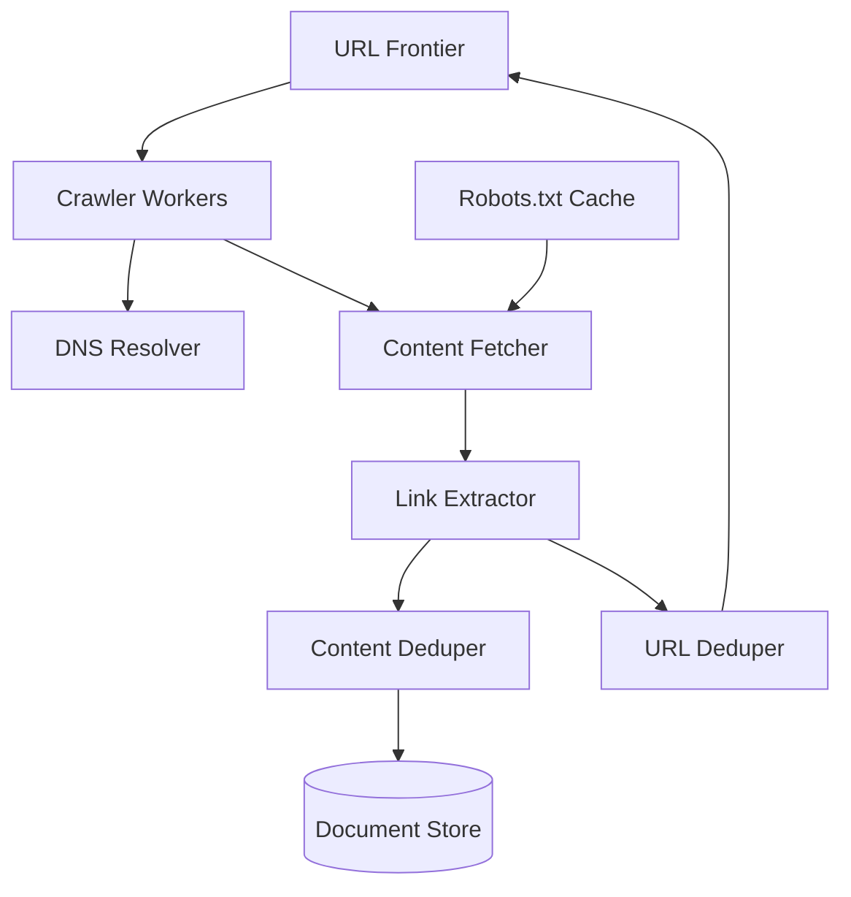

# Case Study: Web Crawler

## 1. Requirements clarifications (Functional & Non-Functional)

### Functional
*   **Crawling:** Scalably scrape text and metadata from billions of web pages across the internet.
*   **Discovery:** Automatically extract new URLs from crawled pages and add them to a frontier for future crawling.
*   **Deduplication:** Efficiently identify and skip already crawled URLs and near-duplicate content.
*   **Freshness:** Periodically recrawl pages to ensure the index reflects recent changes and updates.

### Non-Functional
*   **Massive Scalability:** Capable of crawling and processing billions of pages per month.
*   **Politeness:** Strictly adhere to `robots.txt` and ensure no single server is overwhelmed by requests.
*   **Extensibility:** Modular architecture to easily support new content types like images, PDFs, and videos.
*   **Robustness:** Handle malformed HTML, crawler traps, and slow servers gracefully.

## 2. System interface definition (APIs)

While primarily an internal background system, the crawler exposes several critical internal interfaces:
*   `addSeedUrls(url_list)`: Populates the frontier with initial URLs to begin the crawling process.
*   `getCrawlStats(crawl_id)`: Provides real-time metrics on crawl progress, success rates, and discovered URLs.
*   `updatePolitenessPolicy(domain, settings)`: Allows manual adjustment of crawling frequency for specific domains.

## 3. Back-of-the-envelope estimation (Capacity Estimation)

*   **Page Volume:** Assume 15 billion pages need to be crawled per month.
*   **Throughput:** 15B / (30 days * 24h * 3600s) $\approx$ 5,700 pages processed per second.
*   **Storage Requirements:** 15B pages * 100KB average size per page $\approx$ 1.5 Petabytes of raw data per month.
*   **Metadata Storage:** Storing URL hashes, crawl dates, and status for 15B pages requires several terabytes of fast-access storage (e.g., Cassandra).

## 4. Defining data model (Database Schema/Model)

*   **URL Frontier:** A distributed, persistent queue (e.g., Kafka or a custom RabbitMQ implementation) used to prioritize and store URLs waiting to be crawled.
*   **URL Set (Deduplication):** A massive Bloom filter or a distributed hash set (e.g., Redis) to track billions of visited URLs with minimal memory overhead.
*   **Document Store:** High-capacity object storage (Amazon S3 or HDFS) for the raw HTML and extracted content.
*   **Metadata DB:** A wide-column NoSQL database like **Cassandra** or **HBase** to store page-level metadata including titles, checksums, and last-modified headers.

## 5. High-level design (with Mermaid)

## 6. Detailed design (Deep dive into components)

### Politeness & Distributed Crawling
To maintain a high crawling rate without causing service disruptions for hosts:
*   **Host-based Queuing:** The Frontier maintains separate sub-queues for each hostname.
*   **Worker Affinity:** Each worker thread is assigned a specific host queue and implements a configurable delay between consecutive requests to the same domain.
*   **Robots.txt Caching:** Crawlers maintain an in-memory cache of `robots.txt` files to avoid redundant fetches before every page request.

### Deduplication Strategies
1.  **URL Deduplication:** Before adding any URL to the frontier, it is normalized (e.g., removing session IDs, converting to lowercase) and checked against a Bloom Filter.
2.  **Content Deduplication:** To identify pages with different URLs but identical content, we use **Simhash** or **MinHash** to generate "fingerprints" of the page content. This allows the system to detect near-duplicates effectively.

### DNS Caching & Optimization
DNS resolution is a common bottleneck. The system uses a dedicated, high-performance local DNS cache to avoid the latency of external lookups for frequently visited domains.

## 7. Identifying and resolving bottlenecks (Scaling/Bottlenecks)

*   **Crawler Traps:** Infinite URL loops (e.g., dynamic calendars) can drain resources. **Resolution:** Implement strict limits on URL length, path depth, and the number of pages crawled per domain.
*   **Network Bandwidth:** Moving 1.5PB of data per month is intensive. **Resolution:** Distribute crawler nodes across multiple geographic data centers to minimize latency and distribute network load.
*   **Dynamic and JavaScript-Heavy Sites:** Standard crawlers cannot see content rendered by React/Angular. **Resolution:** Integrate headless browser engines (e.g., Playwright) for targeted crawling of high-value dynamic sites, despite the increased CPU cost.
*   **Frontier Priority:** Not all pages are equally important. **Resolution:** Implement a scoring algorithm based on page rank or update frequency to prioritize high-value URLs in the frontier.
