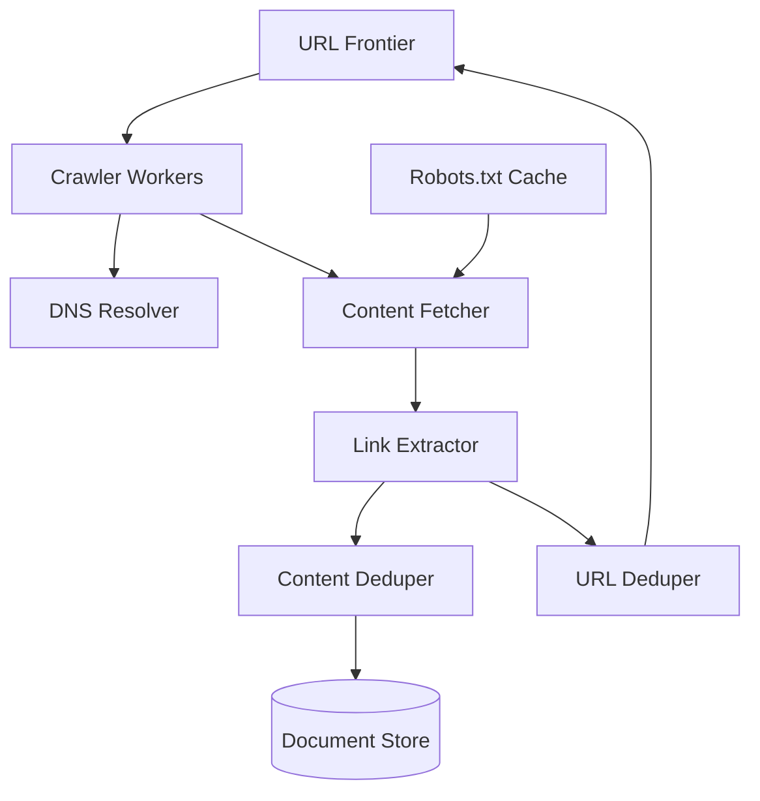

# Case Study: Web Crawler

## 1. Requirements

### Functional
*   **Crawling:** Scrape text and metadata from billions of web pages.
*   **Discovery:** Extract URLs from crawled pages and add them to a frontier for future crawling.
*   **Deduplication:** Avoid crawling the same content multiple times.
*   **Freshness:** Periodically recrawl pages to detect changes.

### Non-Functional
*   **Scalability:** Crawl billions of pages per month.
*   **Politeness:** Do not overwhelm a single server with requests (obey `robots.txt`).
*   **Extensibility:** Support new content types (images, PDFs) easily.

## 2. Capacity Estimation
*   **Page Volume:** 15 billion pages per month.
*   **Throughput:** 15B / (30 days * 24h * 3600s) $\approx$ 5,700 pages/second.
*   **Storage:** 15B pages * 100KB/page $\approx$ 1.5 Petabytes per month.

## 3. APIs
Since a crawler is typically an internal background system, it doesn't have public APIs. However, it exposes internal interfaces:
*   `submitSeedURLs(url_list)`
*   `getStatus(crawl_id)`

## 4. DB Design
*   **URL Frontier:** A massive distributed queue (e.g., Kafka or custom) to store URLs to be crawled.
*   **URL Set:** A hash set or Bloom filter of billions of URLs to track which ones have already been visited.
*   **Document Store:** HDFS or S3 to store the actual HTML/content.
*   **Metadata DB:** Cassandra or HBase to store page metadata (title, last crawl date, checksum).

## 5. HLD with Mermaid

## 6. Detailed Design

### Politeness & Distributed Crawling
To avoid DDOSing a website:
*   **Host-based Queuing:** The Frontier maintains separate queues for different hostnames.
*   **Worker Affinity:** A worker thread is assigned to a specific hostname queue and waits between requests.

### Deduplication
1.  **URL Deduplication:** Use a Bloom Filter to quickly check if a URL has been seen.
2.  **Content Deduplication:** Use **Simhash** or regular MD5/SHA-256 on the page content to detect near-duplicates (e.g., same page with different session IDs).

### DNS Caching
DNS resolution can be a bottleneck. Crawlers must maintain a local DNS cache to avoid repeated lookups for the same domain.

## 7. Bottlenecks
*   **Traps:** Infinite loops (e.g., `calendar.com/today/next/next...`). Solution: Limit URL length and depth.
*   **Bandwidth:** Crawling 1.5PB/month requires massive network throughput. Deploy crawlers in multiple data centers worldwide.
*   **Dynamic Content:** Many modern sites use React/Angular. Solution: Use headless browsers (Puppeteer/Selenium), though this is much slower.
