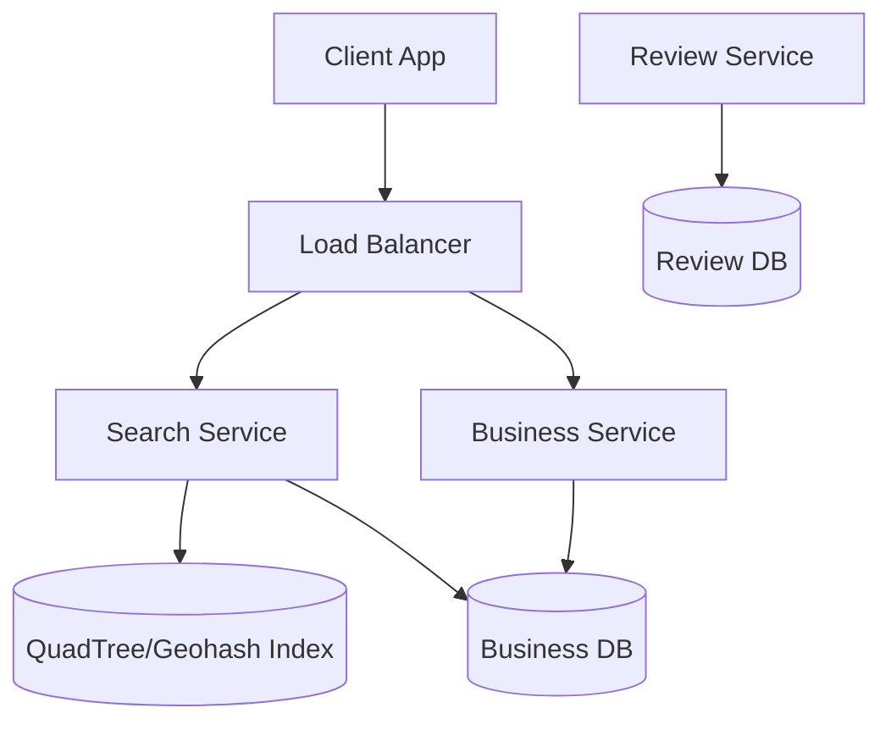

# Case Study: Yelp (Proximity Server)

## 1. Requirements clarifications (Functional & Non-Functional)

### Functional
*   Users can search for nearby places (restaurants, theaters) within a given radius.
*   Users can add/update/delete business information.
*   Users can add reviews and ratings to businesses.

### Non-Functional
*   **Low Latency:** Real-time search results ( < 500ms).
*   **Scalability:** Support 500M points of interest (POI) and 50k search requests per second.
*   **Availability:** System must be highly available.

## 2. System interface definition (APIs)
*   `search(lat, long, radius, category, filter)`
*   `getBusinessDetails(business_id)`
*   `addReview(business_id, user_id, rating, comment)`

## 3. Back-of-the-envelope estimation (Capacity Estimation)
*   **POI Count:** 500M businesses.
*   **Daily Active Users:** 30M.
*   **Search Volume:** 100M searches per day.
*   **Storage:** 500M POI * 1KB/POI $\approx$ 500GB for business data.

## 4. Defining data model (Database Schema/Model)
*   **Business Table:** Relational (MySQL/PostgreSQL).
    *   `business_id (PK), name, address, latitude, longitude, category`.
*   **Review Table:** `review_id, business_id, user_id, rating, timestamp`.
*   **Geospatial Index:** Specialized index for location-based queries.

## 5. High-level design (with Mermaid)

## 6. Detailed design (Deep dive into components)

### Geospatial Indexing
Standard DB queries `WHERE lat BETWEEN ... AND long BETWEEN ...` are slow for large datasets.
1.  **Geohashing:** Divides the earth into a grid. Each cell is represented by a base32 string. Nearby locations share common prefixes.
2.  **QuadTrees:** A tree data structure where each node has four children. A node is split into four quadrants when it exceeds a certain number of POIs.
    *   **In-Memory QuadTree:** Fast, but requires 20-30GB of RAM for 500M POIs.
    *   **Updating QuadTree:** Tricky for moving objects, but Yelp POIs (restaurants) are static, so it's easier.

### Data Partitioning
*   **By Region:** Store POIs of a specific city/country on one server. *Issue: Hotspots (NYC/London).*
*   **By LocationID:** Use consistent hashing based on the `location_id`.

### Caching
Cache popular search results (e.g., "Best Pizza in NYC") using Redis.

## 7. Identifying and resolving bottlenecks (Scaling/Bottlenecks)
*   **Read-Heavy Traffic:** Proximity searches are very frequent. Use read-replicas for the Business DB.
*   **QuadTree Rebuilding:** If many new businesses are added, the tree might become unbalanced. Periodic background rebalancing is needed.
*   **Precision:** High-precision Geohashes use more storage; 5-6 characters (approx 1km-5km) is usually sufficient for city searches.

## Likely Follow-Up Questions

??? "How do we handle high write throughput for new reviews?"

    Reviews are written to a primary database and then asynchronously indexed into the search engine (like Elasticsearch) and the Quadtree to ensure search availability isn't blocked by write latency.

??? "How can we improve search performance for very dense areas like NYC?"

    We can use a dynamic Quadtree where nodes are split further when they exceed a certain number of businesses, ensuring that searches in dense areas remain efficient.

??? "How do we ensure review authenticity and prevent fraud?"

    We implement fraud detection algorithms that analyze user patterns (frequency, location, IP) and use machine learning models to identify suspicious review clusters or bot-like behavior.

??? "How would we support "Open Now" filters in search?"

    Business hours are stored in the database. The search query filters the results by checking the current timestamp against the business's operating hours index.
