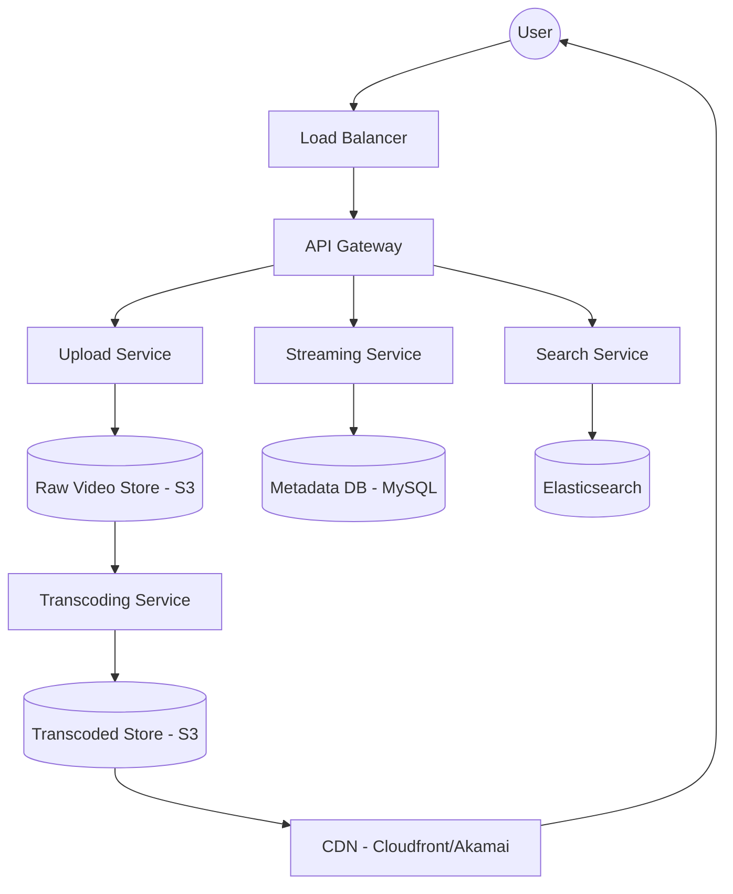

# YouTube System Design

## 1. Requirements Clarifications

### Functional Requirements
- **Upload Videos:** Users can upload videos.
- **View Videos:** Users can watch videos on various devices (Desktop, Mobile, TV).
- **Search:** Search for videos by title.
- **Stats:** Track views, likes, and dislikes.
- **Comments:** Users can add comments to videos.

### Non-Functional Requirements
- **Low Latency:** Streaming should start instantly with minimal buffering.
- **High Availability:** The service must be accessible 24/7.
- **Reliability:** Uploaded videos must not be lost.
- **Scalability:** Handle millions of concurrent viewers and thousands of uploads per minute.

---

## 2. Capacity Estimation and Constraints

### Traffic Estimates
- **Total Users:** 2 Billion.
- **DAU:** 500 Million.
- **Upload Rate:** 5 videos per second on average.
- **View Rate:** 200 videos per second.
- **Read/Write Ratio:** 40:1.

### Storage & Bandwidth
- **Storage:**
    - 5 videos/sec * 86,400 sec/day = 432,000 videos/day.
    - Avg video size (compressed multiple formats): 500 MB.
    - Daily Storage: 432,000 * 500 MB ≈ 216 TB/day.
- **Bandwidth:**
    - Incoming: 5 * 50MB (raw) = 250 MB/sec.
    - Outgoing: 200 views/sec * 10MB (avg streamed) = 2 GB/sec.

---

## 3. System APIs

### Video Service
- `uploadVideo(userId, title, description, tags, category, videoFile)` -> Returns `videoId` and `uploadUrl`.
- `getVideoMetadata(videoId)` -> Returns Video object.

### Streaming Service
- `streamVideo(videoId, offset, codec, resolution)` -> Returns Video Stream (Chunks).

### Interaction Service
- `addComment(userId, videoId, text)`
- `rateVideo(userId, videoId, rating)` (Like/Dislike).

---

## 4. Database Design

### Metadata DB (SQL - MySQL/Vitess)
| Column | Type | Description |
| :--- | :--- | :--- |
| `video_id` | VARCHAR(16) (PK) | Unique Video ID |
| `user_id` | BIGINT (FK) | Uploader ID |
| `title` | VARCHAR(128) | Video Title |
| `description` | TEXT | Description |
| `url` | VARCHAR(255) | GCS/S3 Path |
| `thumbnail_url` | VARCHAR(255) | Thumbnail path |
| `created_at` | TIMESTAMP | Upload time |

### Comments DB (NoSQL - Cassandra)
*Chosen for high write throughput and scalability.*
- Partition Key: `video_id`
- Clustering Key: `created_at`, `comment_id`

### Video Stats (Redis/BigTable)
- Key: `video_id`, Value: `{views, likes, dislikes}`.

---

## 5. High Level Design

---

## 6. Detailed Component Design

### Video Transcoding (Encoding)
When a video is uploaded, it must be processed to support various devices and network speeds.
- **Workflow (DAG):**
    1. **Splitting:** The video is split into small chunks (e.g., 4-10 seconds).
    2. **Transcoding:** Each chunk is encoded into multiple resolutions (144p, 360p, 720p, 1080p, 4K) and formats (H.264, VP9).
    3. **Merging:** Metadata for chunks is stored.
- **Adaptive Bitrate Streaming (ABR):** Protocols like **DASH** (Dynamic Adaptive Streaming over HTTP) or **HLS** allow the client to switch resolutions dynamically based on current bandwidth.

### CDN and Edge Caching
- 90% of traffic is served via CDNs.
- Popular videos are cached at edge locations close to users.
- Less popular videos are fetched from the origin server (S3).

---

## 7. Identifying and Resolving Bottlenecks

### Database Sharding
- **By Video ID:** Sharding the metadata DB by `video_id` ensures even distribution of traffic.
- **Read Replicas:** Use read replicas for the metadata DB to handle the heavy read load for video info and search.

### Video Deduplication
- Use hashing (e.g., MD5 or SHA-256) on video chunks to identify and remove duplicate uploads, saving petabytes of storage.

### Throttling & Queueing
- **Message Queues (Kafka):** Used to decouple the upload service from the transcoding service. If transcoding lags, the queue absorbs the burst.
- **Priority Queue:** Give higher transcoding priority to "Trending" or "Verified" creators.

## Likely Follow-Up Questions

??? "How do we handle copyright infringement and DMCA takedowns?"

    We use a Content ID system that generates fingerprints for uploaded videos and compares them against a database of copyrighted material. Matches can trigger automatic blocking or monetization by the copyright owner.

??? "What happens if a video upload is interrupted?"

    We support resumable uploads by chunking the video file and tracking the uploaded offsets. The client can resume from the last successful chunk instead of restarting the entire process.

??? "How do we optimize for low-latency playback globally?"

    Videos are replicated across multiple CDNs and edge points of presence (PoPs) to ensure content is served from the closest geographical location to the user.

??? "How do we manage different resolution versions of the same video?"

    An adaptive bitrate streaming (ABR) protocol like DASH or HLS is used. The server prepares multiple encodings, and the player dynamically switches between them based on the user's current bandwidth.
