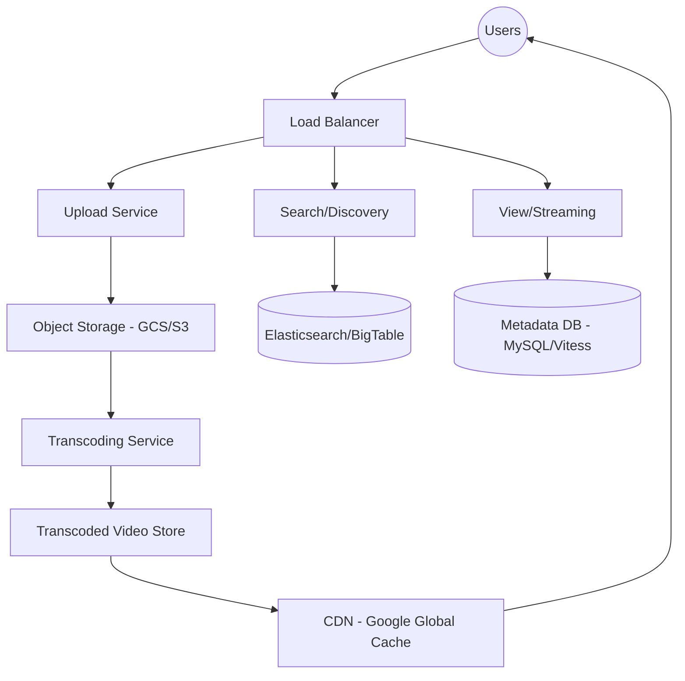

# YouTube Design

## Problem Statement

Design a video-sharing platform that:
- Supports video uploads (up to 4K/8K)
- Provides smooth video streaming globally
- Tracks views, likes, and comments
- Supports video search and recommendations

## Key Challenges

1. **Video Transcoding**: Converting high-resolution uploads into dozens of formats and bitrates for different devices.
2. **Storage and Bandwidth**: Storing petabytes of data and serving it with minimal buffering.
3. **Availability**: Videos should be available globally with low latency.
4. **Search and Discovery**: Real-time search indexing and personalized recommendations.

## Architecture Overview

## Data Model

**Videos Metadata (MySQL/Vitess)**
- video_id (PK), user_id, title, description, thumbnail_url, duration, visibility_status

**Video Analytics (BigTable)**
- video_id, views_count, likes_count, dislikes_count

**Comments (Cassandra)**
- comment_id, video_id, user_id, text, created_at

## Key Decisions

- **Chunked Uploads**: Large video files are split into small chunks (e.g., 4MB). If an upload is interrupted, the client only needs to resume from the last successful chunk.
- **Adaptive Bitrate Streaming (ABR)**: Uses protocols like **DASH** or **HLS**. The video player automatically detects the user's bandwidth and switches between different bitrates (e.g., 360p, 720p, 1080p) during playback.
- **Global CDN Strategy**: Most of the bandwidth is served from the edge. YouTube uses its own global network of points of presence (PoPs) to cache video content as close to the user as possible.
- **Database Sharding (Vitess)**: To handle billions of rows of metadata, YouTube uses **Vitess**, a clustering system for horizontal scaling of MySQL through sharding.
- **Video Transcoding DAG**: Transcoding is a complex workflow (extract audio, generate thumbnails, encode various resolutions). This is managed using a Directed Acyclic Graph (DAG) and a distributed task queue to ensure reliability and scalability.
- **Read-Heavy Metadata**: Frequently accessed metadata (video title, view count) is cached in **Redis** or **Memcached** to reduce database load.
